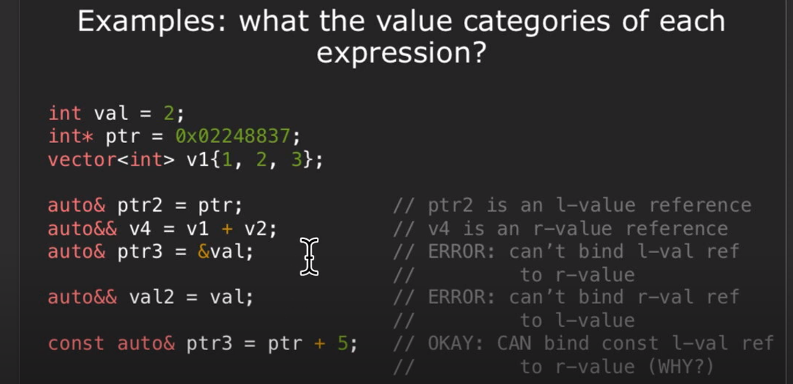
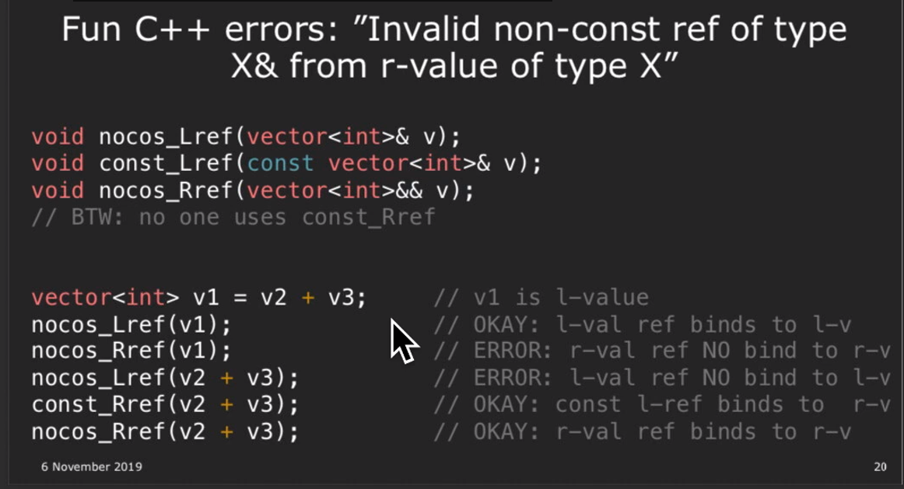
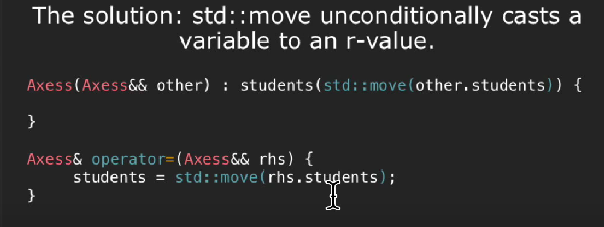

# R/L Value

An object that is an ***r-value*** is disposable, so you can either copy or move from. While ***l-value*** can only be copied from.





rvalue ref binds to an rvalue, but the rvalue ref itself is an lvalue bc it has an name and an identity


# Move



move overrides that and treat this as temporary value

std::move并不能移动任何东西，它唯一的功能是将一个左值强制转化为右值引用，继而可以通过右值引用使用该值，以用于移动语义，确切地说，它使一个值易于移动。  
从实现上讲，std::move基本等同于一个类型转换：static_cast<T&&>(lvalue);  
std::move函数可以以非常简单的方式将左值引用转换为右值引用。当我们在设计类的时候，都应该尽量去实现移动构造函数。  
通常，当我们需要交换两个变量的值的时候，使用3次复制的方法，如以下代码:

```cpp
template <typename T>
void swap(T& a, T&b){
    T temp = a;
    a = b;
    b = temp;
}
```

```cpp
template <typename T>
void swap(T& a, T& b){
    T temp = std::move(a);  // cast to rvalue, no need to copy
    a = std::move(b);
    b = std::move(temp);
}
```
