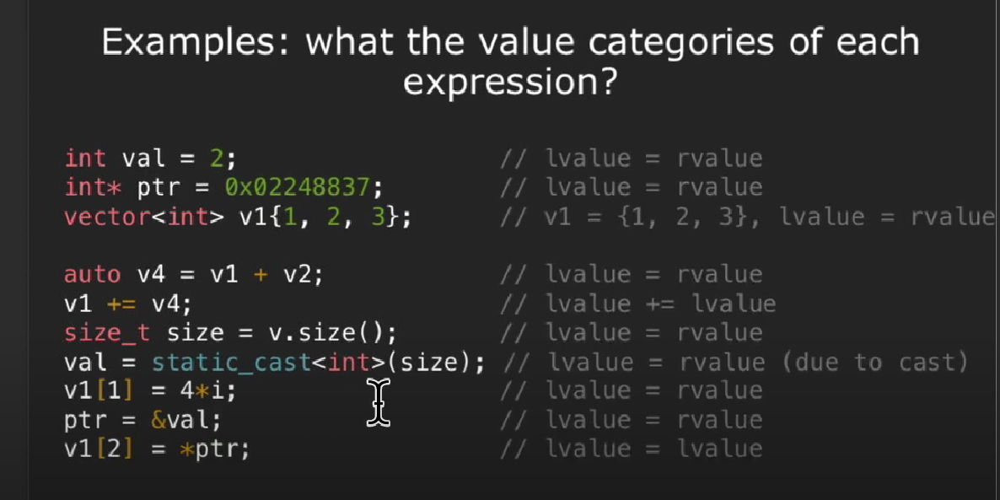
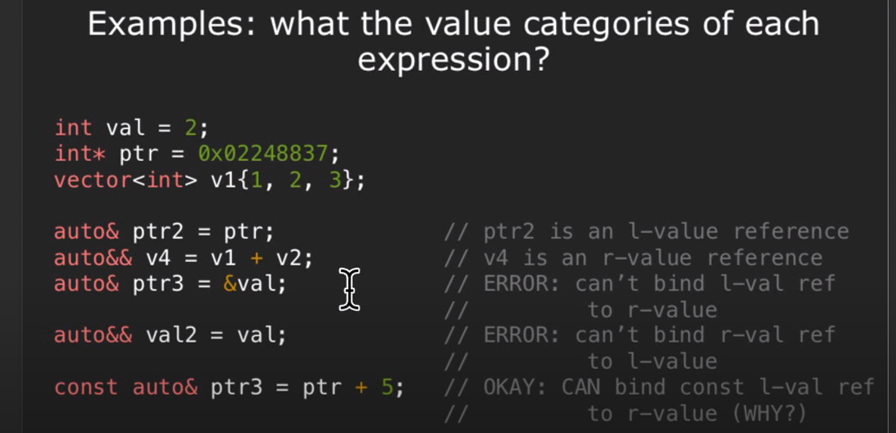
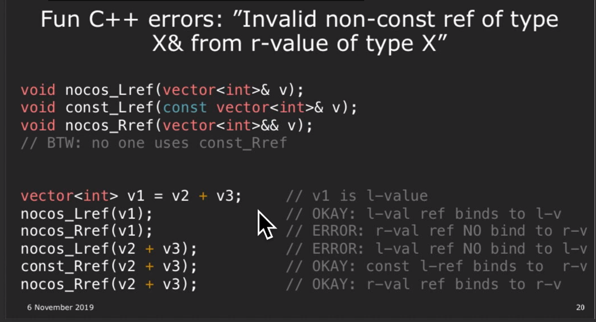
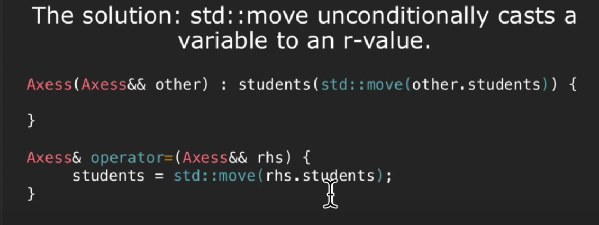

# R/L Value




# Move

An object that is an ***r-value*** is disposable, so you can either copy or move from. While ***l-value*** can only be copied from.



rvalue ref binds to an rvalue, but the rvalue ref itself is an lvalue bc it has an name and an identity

move overrides that and treat this as temporary value

std::move并不能移动任何东西，它唯一的功能是将一个左值强制转化为右值引用，继而可以通过右值引用使用该值，以用于移动语义，确切地说，它使一个值易于移动。  
从实现上讲，std::move基本等同于一个类型转换：static_cast<T&&>(lvalue);  
std::move函数可以以非常简单的方式将左值引用转换为右值引用。当我们在设计类的时候，都应该尽量去实现移动构造函数。  
通常，当我们需要交换两个变量的值的时候，使用3次复制的方法，如以下代码:

```cpp
template <typename T>
void swap(T& a, T&b){
    T temp = a;
    a = b;
    b = temp;
}
```

```cpp
template <typename T>
void swap(T& a, T&b){
    T temp = std::move(a);  // cast to rvalue, no need to copy
    a = std::move(b);
    b = std::move(temp);
}
```

# Rule of Five

If explicitly define(or delete) a copy constructor, copy assignment, move constructor, move assignment, or destructor then you should define(or delete) all 5.