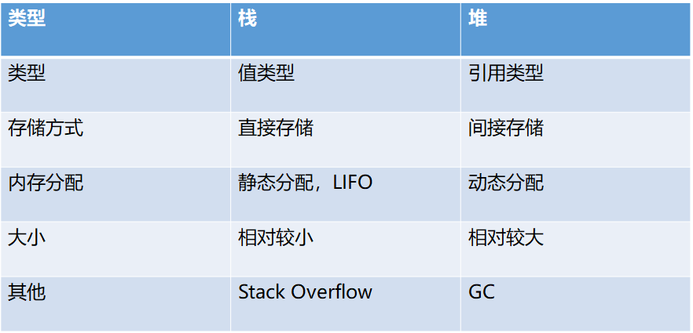

# 内存分区模型

- 代码区: 存放函数体的二进制代码，由操作系统进行管理
- 全局区: 存放全局变量、静态变量以及常量
- 栈区： 由编译器自动分配释放，存放函数的参数值，局部变量等
- 堆区：由程序员分配和释放，若程序员不释放，程序结束时由操作系统回收

# 内存四区意义
不同区域存放的数据，赋予不同的生命周期，给我们更大的灵活编程

# 程序运行前
在程序编译后，生成了exe可执行程序，未执行程序前分为两个区域

## 代码区
- 存放cpu执行的机器指令
- 代码区是共享的，共享的目的是对于频繁被执行的程序，只需要在内存中有一份代码即可
- 代码区是只读的，使其只读的原因是防止程序意外的修改了他的指令

## 全局区
- 全局变量，静态变量(static)
- 常量区，字符串常量和其他常量（const修饰的全局变量）
- 该区域的数据在程序结束后由操作系统释放

## 栈区
- 由编译器自动分配释放，存放函数的参数值，局部变量等
- 不要返回局部变量的地址
- 形参也会放到栈区
- 很小:  
SunOS/Solaris 8172K bytes (Shared Version)  
Linux 10240K bytes   
Windows 1024K bytes (Release Version)  
AIX 65536K bytes  
https://developer.apple.com/library/archive/documentation/Cocoa/Conceptual/Multithreading/CreatingThreads/CreatingThreads.html
根据苹果线程成本说明，iOS的主线程栈大小不超过1MB，OS X主线程栈最大8MB，子线程栈最大512KB。子线程在创建的时候可以更改栈的大小，子线程允许设置的最小栈大小为16 KB，并且栈大小必须为4 KB的倍数。主线程的栈大小无法修改。  
https://zhuanlan.zhihu.com/p/33562383
安卓主线程栈大小默认为8M，子线程栈大小稍微小于1M

## 堆区
- 由程序员分配和释放，若程序员不释放，程序结束时由操作系统回收
- c++中利用new在堆区开辟内存

# 为什么栈比堆块

1、有寄存器直接对栈进行访问（esp，ebp），而对堆访问，只能是间接寻址。

也就是说，可以直接从地址取数据放至目标地址；使用堆时，第一步将分配的地址放到寄存器，然后取出这个地址的值，然后放到目标地址。

2、栈中数据cpu命中率更高，满足局部性原理。

3、栈是编译时系统自动分配空间，而堆是动态分配（运行时分配空间），所以栈的速度快