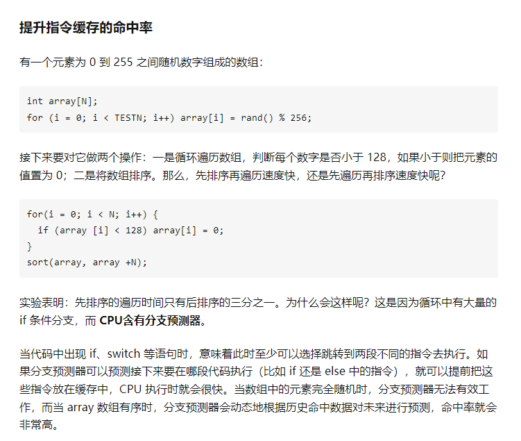
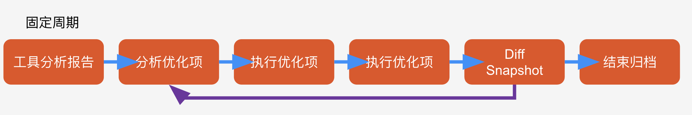

# 性能优化

对于程序来说，出现短板时优化

- CPU
- GPU
- 内存
- 存储IO

## 确定问题

### 常见问题

- 卡顿——帧数过低
- 闪退 ——异常、内存
- 越玩越卡——内存泄露
- 手机发烫——长时间负载过高

### 获得方式

- 日志：
    - 崩溃日志、开发日志、Track  

- 工具：
    - Unity Profiler
    - Memory Profiler
    - XCode Instrument
    - Android Studio Profiler
    - ...

## 明确目标

- 可衡量
    - 指标：
        - 崩溃？帧数？内存？
    - 环境参数：
        - CPU、内存、GPU —— 设备
        - 系统：iOS、Android
- 制定标准：
    - 内存不超过xxMB？
    - 帧数不低于30？60？


```
- 在iPhone6上能稳定在30帧
    - 不能有帧GCAlloc
    - 消除GCAlloc峰值
    - 降低GC频率，每分钟GC次数不超过3次？
    - 降低GC时长，Mono对象不超过80M？
- 在iPhone6上基本不闪退
    - Mono稳定在120M??以内
    - UnityNative稳定在120M??以内
    - iPhone6总内存小于550M（650会被杀掉）
```

## 制定解决方案

- 内存占用过大？
    - 贴图压缩、流式加载
- CPU瓶颈？
    - 优化算法、分帧、多线程、计算量转移
- 渲染问题？
    - 简化场景？合批？
    - 调整渲染方式？
- 加载慢？
    - 调整加载流程、分块加载
    - 减少加载体积

# 关于内存

- 刚才说的特点中
    - 较高的存取速度
    - 随机存取
- 对于程序来说
    - 程序本身装在在内存中
    - 程序中用到的数据、资源
- 工具中的内存指的都是什么？ PSS
    - VSS Virtual Set Size 虚拟耗用内存（进程占用内存（包含使用与未使用） + 包含共享库占用的内存）
    - RSS  Resident Set Size 实际使用物理内存（正在使用内存 + 共享库占用的内存）
    - PSS  Proportional Set Size 实际使用的物理内存（正在使用内存 + 比例分配共享库占用的内存）
    - USS  Unique Set Size 进程独自占用的物理内存（正在使用内存）

# 常见内存问题

- 内存泄露
- 内存峰值
- 垃圾回收
- 缓存命中率

## 内存泄漏

- 简单概括
    - 内存占用没有被正确释放
- 危害
    - 内存不受控，变得越来越大

```
Unity中，
资源泄露
AssetBundle
第三方插件库泄露

Texture2D texSource = new Texture2D(512, 512, TextureFormat.RGBA32, false);
 
//do something...

Destroy(texSource);
```

- 如何避免
    - 了解生命周期
    - 良好的使用习惯
    - 有监控机制或工具

- 定位和解决问题
    - 内存快照
    - 反复切换场景对比
        - pss

```
误区
- 误区一
    出场景前后内存回落不一致，即说明内存存在泄露情况。
- 误区二
    Unity Profiler中内存回落正常，但Android的PSS数值并没有完全回落（出场景后的PSS值高于进场景前的PSS值），即说明内存存在泄露情况。
- 造成内存不能完全回落的情况有很多
    资源加载后常驻内存以备后续使用
    Mono堆内存的只升不降
```

## 内存峰值

- 问题
    - 峰值过高，会有风险被干掉
- 原因
    - 内存一直涨
        - 内存泄露
        - 无效的Mono堆内存开销
        - 不清理、缓存过多
    - 内存占用大
        - 一次性申请内存过大
        - 资源冗余
- 如何避免
    - 及时清理不使用内存
    - 避免一次申请过大内存
        - 分块加载
        - 按需加载
        - 缩小资源体积
    - 冗余资源检查
    - 严防内存泄露


## 垃圾回收

- 关于GC
    - 内存自动回收的机制
    - 申请和释放堆内存触发GC
    - 导致卡顿
- UnityGC问题老生常谈
    - 原始的垃圾回收器
    - 关于垃圾回收算法

```
- Boehm-Demers-Weiser
    它是基于Mark&Sweep算法实现的，特点与标准的Mark&Sweep算法一致
- Stop the World
    当发生GC时，程序的所有线程必须停止工作，等GC完才能继续。 
- 非压缩式的
    不会对堆内存碎片进行整理，导致碎片化。
- 不分代
```
```
GC典型的问题
    拆箱装箱
    字符串拼接  string的不可变性，每次拼接都要建新串
    协程  本质是单线程

// 拆箱装箱
for (var i = 0; i < 100000; i ++ )
{
    int val = 100;     // 装箱
    object obj = val; 
    int num = (int) obj;  // 拆箱
}
```


## 缓存命中率

越小的缓存离CPU的距离越近，设计上速度也越快，相对来说容量也越小。但是缓存级数也不是越多越好，因为CPU查找指令的时候是逐级查找，如果找到了倒也罢了，如果找不到就浪费了多次检索过程。

CPU在执行某个程序片段的时候，它会安排缓存帮它预测下次要查找的数据，然后逐级上报，如果下次查找的数据正好在缓存里，就叫缓存命中，如果不在，就叫Miss。如果Miss了，CPU就不得不亲自去内存里找，速度可想而知。

所以现在知道ECS面对数据编程，对于缓存命中的重要性有多高了。因为硬遍历就是指不做任何优化措施，直接做循环，但这种方式其实是比较符合CPU缓存设计的，所以本身天然的性能就会高一些；相反，如果做了四叉树的场景，则会打乱了CPU缓存，所以看起来算法上提高了，但是在CPU执行的时候性能并没有提升太多。（光线追踪的管线里有两次重要的排序，都是为了排列数据提高效率。）




# 性能优化 帧率

## 性能问题

- 资源加载
- 美术用了高精度贴图

卡顿：单位绘制帧间隔执行过长 - 视觉感官不连贯


来自：计算量，算力，发热，等待（多线程同步，管线计算瓶颈）

## 如何优化

如何做出流畅的游戏？
充分合理利用有限的CPU/GPU时间片

怎么做性能优化？
居高临下，俯瞰众生（了解游戏每个方面，决定优化哪里）
始于数据 终于数据

- 确立机型
- 分清主次
- 工具分析
- 内容分级（高中低机型，对应不同质量设置）
- 形成流水线

### 确立机型

普适：市场占有率>90%, TOP300, 全用户休闲品类  
目标：最高目标机型，最高效果游戏体验，高端用户品类

### 分清主次
找瓶颈，二八原则，收益最大

### 工具分析
根据报告做出Jank(突然卡顿)优化方案
引擎分析，GPU分析

打点分析
arctan时间 > sqrt时间 > arcsin时间 (可能编译器做过优化)

***常见性能问题***
- IO
- 资源体量过大
- 瞬时大内存操作
- 渲染压力过大
- 渲染量激增
- 触发GC
- 触发复杂逻辑运算

***优化方法***
- 算力
    - 摊帧法
    - 限制数量法
    - 逻辑优化（做表）
    - 降帧法（一直30fps比60，40来回跳体验更好）
    - NoGC编程
    - 多线程（资源加载，IO，网络通信可以开）

- IO
    - 预加载（使用的时候开关操作）
    - 异步加载
    - 压缩资源
    - 多级缓存
    - 控制Log（连接字符串方式不好会产生GC）
    - LoadingUI

- 批处理（CPU向GPU提交任务的过程）
    - 使用图集
    - 静态批处理
    - 动态批处理
    - GPUInstancing
    - 运行时批处理
    - SRP Batcher（用了相同的shader可以批处理）

### 内容分级

QualitySettings  
DiancesLOD (根据远近改变质量)  
AssetsLOD  
GraphicSettings


### 形成流水线



## 突破限制

- 超大虚拟空间
- 海量游戏实体
- 高级仿真模拟

能否利用优先资源实现？  
- 缓存池技术（战神4大世界）
- 平衡体验
- 云游戏