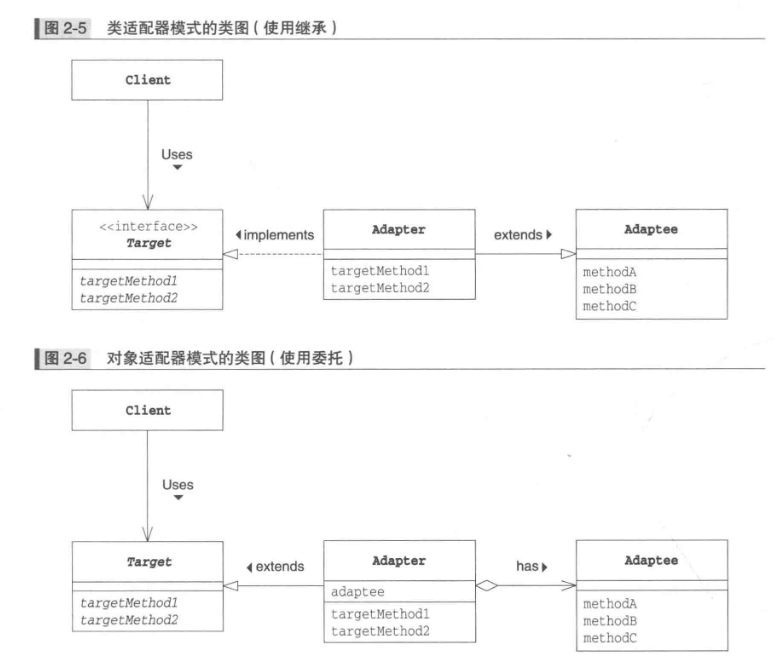

# 图解设计模式

## 1. 适应设计模式

### 1.1 Iterator模式


- 不管实现如何变化，都可以使用lterator

不用for循环，而使用Iterator模式的一个重要的理由：引入Iterator后可以将遍历与实现分离开来。
```java
while (it.hasNext()) {
    Book book =(Book)it.next();
    System.out.println(book.getName());
}
```

这里只使用了Iterator的hasNext()和next()，并没有调用BookShelf的方法。

即：这里的while循环并不依赖于BookShelf的实现。

- 难以理解抽象类和接口

不要只使用具体的类来解决问题，很容易导致类之间的强耦合，这些类也难以作为组件被再次利用。要优先使用抽象类和接口来解决问题。

- 不需要 DelIterator 
- 
在Java中，没有被使用的对象实例将会自动被删除（垃圾回收，GC)。因此，在iterator中不需要与其对应的deleteIterator方法。

### 1.2 Adapter模式：加个“适配器”以便于复用



- 什么时候使用Adapter模式
如果某个方法就是我们所需要的方法，那么直接在程序中使用不就可以了吗？为什么还要考虑使用Adapter模式呢？

很多时候，我们并非从零开始编程，经常会用到现有的类。特别是当现有的类已经被充分测试过了，Bug很少，而且已经被用于其他软件之中时，我们更愿意将这些类作为组件重复利用。

Adapter模式会对现有的类进行适配，生成新的类。通过该模式可以很方便地创建我们需要的方法群。

当出现Bug时，由于我们很明确地知道Bug不在现有的类(Adaptee角色）中，所以只需调查扮演Adapter角色的类即可，方便排查代码问题。

使用Adapter模式可以在完全不改变现有代码的前提下使现有代码适配于新的接口(API)。


- 版本升级与兼容性

例如，假设我们今后只想维护新版本。这时可以让新版本扮演Adaptee角色，旧版本扮演Target角色。接着编写一个扮演Adapter角色的类，让它使用新版本的类来实现旧版本的类中的方法。


## 2. 交给子类

### 2.1 Template Method模式

- AbstractClass（抽象类）

不仅负责实现模板方法，还负责声明在模板方法中所使用到的抽象方法。

这些抽象方法由子类ConcreteClass角色负责实现。

在示例程序中，由AbstractDisplay类扮演此角色。

- ConcreteClass（具体类）

该角色负责具体实现AbstractClass角色中定义的抽象方法。这里实现的方法将会在AbstractClass角色的模板方法中被调用。

在示例程序中，由CharDisplay类和stringDisplay类扮演此角色。

- 可以使逻辑处理通用化
本模式的好处：在父类的模板方法中编写了算法，无需在每个子类中再编写算法。若模板方法中发现Bug，只需修改模板方法即可。

假设没使用Template Method模式，而是复制粘贴编写了多个ConcreteClass角色，会出现ConcreteClassl、ConcreteClass2、ConcreteClass3等很多相似的类。其中一个有bug，其他类似的都得跟着再改一遍。

- 父类与子类之间的协作

在子类中实现父类中声明的抽象方法时，必须要理解这些抽象方法被调用的时机。若看不到父类的源代码，很难编写出子类。

- 父类与子类的一致性


### 2.2 Factory Method模式


生成实例——方法的三种实现方式
在示例程序中，Factory类的createProduct方法是抽象方法，也就是说需要在子类中实现该方法。

createProduct方法的实现方式一般有以下3种。

1. 指定其为抽象方法

一旦将createProduct指定为抽象方法后，子类就必须实现该方法，否则编译错误。这也是示例程序所采用的方式。

2. 为其实现默认处理

实现默认处理后，如果子类没有实现该方法，将进行默认处理。

不过，这时是使用new关键字创建出实例的，因此不能将Product类定义为抽象类。


3. 在其中抛出异常

createProduct方法的默认处理为抛出异常，这样如果未在子类中实现该方法，程序就会在运行时出错（报错，告知开发人员没有实现createProduct方法）。


## 3. 生成实例

### 3.1 Singleton

### 3.2 Prototype


### 3.3 Builder模式


Builder类是abstract class，被作为参数pass 到Director类。construct 依次call builder方法。

### 3.4 Abstract Factory模式


将抽象零件组装为抽象产品，也就是product 是abstract的。

不关心零件的具体实现，只关心接口。用接口将零件组装为产品。比如product的add方法。


- 易于增加新具体工厂，难以增加新的零件

## 4. 分开考虑

### 4.1 Bridge模式


- 将类的功能层次结构和实现层次结构分开，想增加功能时只需在“功能层次”增加更改，增加后的功能可被所有实现使用。e.g.，定义共同api的implementor，然后编写比如mac,win,unix三个concreteImplementor，这样不论abstraction多了多少功能，都可以工作在这三个操作系统上。

- 继承是强关联，委托是弱关联


### 4.2 Strategy模式


- 使用委托 这种弱关联关系可以很方便地整体替换算法。
- 运行中也可以切换concrete strategy

## 5. 一致性

### 5.1 Composite模式

容器和内容具有一致性，创造出递归结构。


### 5.2 Decorator模式


## 6. 访问数据结构

### 6.1 Visitor模式


- 双重分发，将处理从数据结构中分离出来。
- 访问者模式的优点：可以在不改变数据结构的前提下，增加新的操作。对扩展开放，修改关闭。

### 6.2 Chain of Responsibility模式


- 弱化了发出请求的人和处理请求的人之间的联系
- 可以动态改变职责链

## 7. 简单化