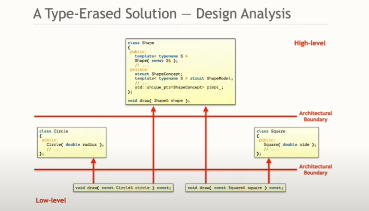

# Type Erasure


### A Type-Erased Solution


```cpp
class Circle
{
public:
    explicit Circle( double rad ) : radius { rad }, // ...Remaining data members
    {}

    double getRadius() const noexcept;
    // double getCentre(), get Rotation(), ...

private:
    double radius;
    // ...Remaining data members
};

class Square
{
public:
    explicit Square( double s ) : side { s }, // ...Remaining data members
    {}

    double getSide() const noexcept;
    // double getCentre(), get Rotation(), ...

private:
    double side;
    // ...Remaining data members
};

//@@ The external Polymorphism Design Pattern

struct ShapeConcept
{
    virtual ~ShareConcept() = default;

    virtual void do_serialize (/*...*/) const = 0;
    virtual void do_draw (/*...*/) const = 0;
    // ...
};

template<typename ShapeT>
struct ShapeModel : public ShapeConcept
{
    ShapeModel(ShapeT value)
        : object{std::move(value)}
    {}
    
    //...

    // @@ Note the do_prefix, whcih avoids naming conflicts
    void do_serialize(/*...*/) const override
    {
        serialize(object, /*...*/);
    }

    // The implementation of the virtual functions in the ShapeModel class defines the affordances required by the type T
    void do_draw(/*...*/) const override
    {
        draw(object, /*...*/);
    }

    ShapeT object;
};

```

The External Polymorphism Design Pattern ..
- allows any object to be treated polymorphically
- extracts implementation details (SRP)
- removes dependencies to operations (affordances)
- creates the opportunity for easy extension (OCP)

```cpp

//@@ These functions resolve requirements posed by EPDP
// canbe many implementation, spread over many header/source files 

void serialize (Circle const&, /*...*/);
void draw (Circle const&, /*...*/);

void serialize (Square const&, /*...*/);
void draw (Square const&, /*...*/);

void drawAllShapes( std::vector<std::unique_ptr<ShapeConcept>> const& shapes)
{
    for(auto const& shape : shapes)
    {
        shape->draw();
    }
}

int main() 
{
    using Shapes = std::vector<std::unique_ptr<ShapeConcept>>;

    // Creating some shapes
    Shapes shapes;
    shapes.emplace_back(std::make_unique<ShapeModel<Circle>>{2.0});
    //...

    //drawing all shapes
    drawAllShapes(shapes);
}
```

shape wrapper

```cpp

class Shape
{
private:
    struct ShapeConcept
    {
        virtual ~ShareConcept() = default;

        virtual void do_serialize (/*...*/) const = 0;
        virtual void do_draw (/*...*/) const = 0;
        virtual std::unique_ptr<ShapeConcept> clone() const = 0; // prototype
        // ...
    };
        
    template<typename ShapeT>
    struct ShapeModel : public ShapeConcept
    {
        ShapeModel(ShapeT value)
            : object{std::move(value)}
        {}
        
        std::unique_ptr<ShapeConcept> clone() const override
        {
            return std::make_unique<ShapeModel>(*this);
        }

        // @@ Note the do_prefix, whcih avoids naming conflicts
        void do_serialize(/*...*/) const override
        {
            serialize(object, /*...*/);
        }

        // The implementation of the virtual functions in the ShapeModel class defines the affordances required by the type T
        void do_draw(/*...*/) const override
        {
            draw(object, /*...*/);
        }

        ShapeT object;
    };


    // new stuff

    friend void serialize(shape const& shape, /*...*/)
    {
        shape.pimpl->do_serialize(/*...*/);
    }

    friend void draw(shape const& shape, /*...*/)
    {
        shape.pimpl->do_draw(/*...*/);
    }


    std::unique_ptr<ShapeConcept> pimpl; // Bridge design pattern

public:
    template<typename ShapeT>
    Shape(ShapeT const& x)     // Templated constructor, creating a bridge
        : pimpl {std::make_unique<ShapeModel<ShapeT>> (x)}
    {}

    // Copy operations
    Shape(Shape const& other) : pimpl (other.pimpl->clone()) {}

    Shape& operaor=(Shape const& other) 
    {
        other.pimpl->clone().swap(pimpl);
        return *this;
    }

    // Move operation
    // Shape(Shape&& other);  //@@ depend on the solution
    Shape& operator=(Shape&& other) noexcept
    {
        pimpl.swap(other.pimpl);
        return *this;
    }

    // ...
};

```


```cpp
void serialize (Circle const&, /*...*/);
void draw (Circle const&, /*...*/);

void serialize (Square const&, /*...*/);
void draw (Square const&, /*...*/);

void drawAllShapes( std::vector<Shape> const& shapes)
{
    for(auto const& shape : shapes)
    {
        draw(shape);
    }
}

//@@ No pointers, no manual dynamic allocation, no manual life-time management, value-semantics, simple code(KISS)

int main() 
{
    using Shapes = std::vector<Shape>;

    // Creating some shapes
    Shapes shapes;
    shapes.emplace_back(Circle{2.0});
    //...

    //drawing all shapes
    drawAllShapes(shapes);
}
```


### Design Analysis





### Type Erasure with Manual Virtual Dispatch

```cpp
class ShapeConstRef
{
public:
    template<typename ShapeT>
    ShapeConstRef(ShapeT const& shape)
        : shape_{std::addressof(shape)}
        , draw_{[](void const* shape){
            draw(*static_cast<ShapeT const*>(shape))
        }}
    {}

private:
    friend void draw(ShapeConstRef const& shape)
    {
        Shape.draw_(shape.shape_);
    }

    using DrawOperation = void(void const*);

    void const* shape_{nullptr};
    DrawOperation* draw_{nullptr};
};
```

### Summary

Type Erasure is ..
- a templated constructor 
- a completely non-virtual interface
- External Polymorphism + Bridge + Prototype
- One of the most interesting design patterns

Type Erasure
- reduces dependencies
- enables value semantics
- improves performance
- improves readability and comprehensibility
- eases maintenance