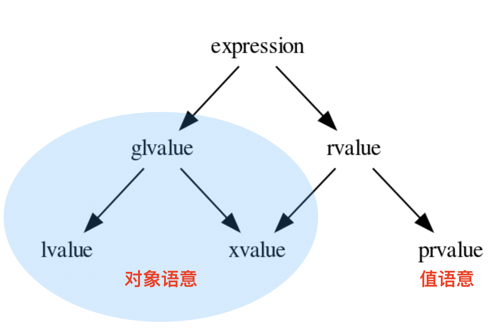
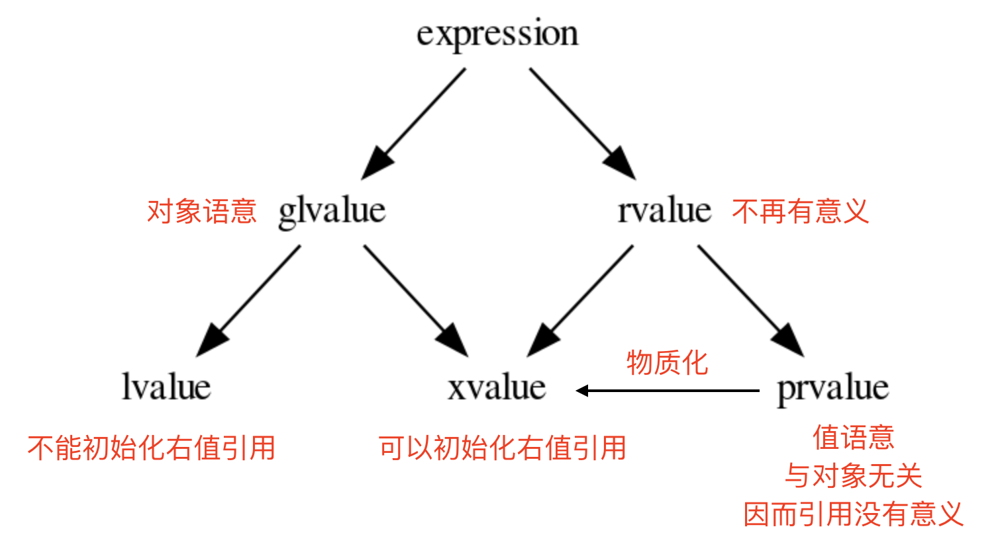

# Understanding Modern C++

## 1. 引用

### 1.1 值与对象

为了理解引用，我们需要首先搞清楚什么叫 左值 与 右值 。

简而言之，左值 是一种 对象 ，而不是 值 。其关键区别在于，是否明确在内存中有其可访问的位置。 即，其是否存在一个可访问的地址。如果有，那么它就是一个 对象 ，也就是一个 左值 ，否则，它就只是 一个 值 ，即 右值 。

比如：你不可能对整数 `10` 取地址，因而这个表达式是一个 右值 。但是如果你定义了一个变量：

```cpp
int a = 10;
```

变量 `a` 则代表一个 对象 ，即 左值 。如果我们再进一步，表达式 a + 1 则是一个右值表达式，因为你无法对这个表达式取地址。

任何可以取地址的表达式，背后都必然存在一个 对象 ，因而也必然属于 左值 。而如果我们把对象地址看作其 身份证 ( Identifier ）， 那么我们也可以换句话说：任何有 身份证 的表达式，都属于 左值 ；否则，肯定属于 右值 。


### 1.2 别名

引用 是 对象 的 别名 。

所谓 别名 ，是指你没有创建任何 新事物 ，而只是对 已存在事物 赋予了另外一个名字。比如：

```cpp
using Int = int;
```

你并没有创建一个叫做 Int 的新类型，而只是对已存在类型 int 赋予了另外一个名字。再比如

```cpp
template <typename T>
using ArrayType = Array<T, 10>;
```

你并没有创建一个签名为 ```ArrayType<T>``` 的新模版，而只是对已存在模版 ```Array<T,N>``` 进行部分实例化后得到的模版，赋予了一个新名字。

因而，引用 作为 对象别名 ，并没有创建任何 新对象 （包括引用自身），而仅仅是给已存在对象赋予了一个新名字。

### 1.3 空间

正是因为其 别名 语义， C++ 没有规定 引用 的尺寸（事实上，从 别名 语义的角度，它本身不需要内存，因而也就没有尺寸而言）。

因而，如果你试图通过 sizeof 去获取一个 引用 的大小，是不可能的。你只能得到它所引用的对象的大小（由于别名语义）

```cpp
struct Foo {
  std::size_t a;
  std::size_t b;
};

Foo foo;
Foo& ref = foo;

static_assert(sizeof(ref) == sizeof(Foo));
```

也正是由于其 别名语义 ，当你试图对一个引用取地址时，你得到的是对象的地址。比如，在上面的例子中， &ref 与 &foo 得到的结果是一样的。

因而，当你定义一个指针时，指针自身就是一个 对象 (左值)；它本身有自己明确的存储，并可以取自己的地址，可以通过 sizeof 获取自己的尺寸。

但是 引用 ，本身不是一个像指针那样的额外对象，而是一个对象的别名， 你对引用进行的任何操作，都是其所绑定对象的操作 。

在上面的例子中，ref 与 foo 没有任何差别，都是对象的一个名字而已。它们本身都代表一个对象，都是一个左值表达式。

因而，在不必要时，编译器完全不需要为引用分配任何内存。

但是，当你需要在一个数据结构中保存一个引用，或者需要传递一个引用时，你事实上是在存储或传递对象的 身份 （即地址）。

虽然这并不意味着 sizeof(T&) 就是引用的大小（从语义上，引用自身非对象，因而无大小，sizeof(T&) == sizeof(T) ），但对象的地址的确 需要对应的空间来存储。

```cpp
struct Bar {
   Foo& foo;
};

// still, reference keeps its semantics.
static_assert(sizeof(Bar::foo) == sizeof(Foo));

// but its storage size is identical to a pointer
static_assert(sizeof(Bar) == sizeof(void*));

// interesting!!!
static_assert(sizeof(Bar) < sizeof(Bar::foo));
```


### 1.4 受限的指针

在传递或需要存储时，一个引用的事实空间开销与指针无异。因而，在这些场景下，它经常被看作一个受限的指针：

1. 一个引用必须初始化。这是因为其 对象别名 语义，因而没有 绑定 到任何对象的引用，从语义上就不成立。
2. 由于必须通过初始化将引用绑定到某一个对象，因而从语义上，不存在 空引用 的概念。这样的语义，对于我们的接口设计，有着很好的帮助： 如果一个参数，从约束上就不可能是空，那么就不要使用指针，而使用引用。这不仅可以让被调用方避免不必要的空指针判断；更重要的是准确的约束表达。
    
    虽然 空引用 从概念上是不存在的，但从事实上是可构造的。比如： `T& ref = *(T*)nullptr`
    
    因而，在项目中，任何时候，需要从指针转为引用时，都需要确保指针的非空性。

    另外，空引用 本身这个概念就是不符合语义的，因为引用只是一个对象的别名。上面的表达式，事实上站在对象角度同样可以构造: `T obj = *(T*)nullptr` 。 正如我们将指针所指向的对象赋值（或者初始化）给另一个对象一样，我们都必须确保指针的非空性。


3. 像所有的左值一样，引用可以绑定到一个抽象类型，或者不完备类型（而右值是不可能的）。从这一点上，指针和引用具有相同的性质。因而，在传递参数时，决定 使用指针，还是引用，仅仅受是否允许为空的设计约束。

4. 一个引用不可能从一个对象，绑定到 另外 一个对象。原因很简单，依然由于其 对象别名 语义。它本身就代表它所绑定的对象，重新绑定另外一个对象，从概念上不通。

    而引用的 不可更换性 ，导致任何存在引用类型非静态成员的对象，都不可能直接实现 拷贝/移动赋值 函数。 因而，标准库中，需要存储数据的，比如 容器 ，tuple , pair , optional 等等结构，都不允许 存储 引用 。

    这就会导致，当一个对象需要选择是通过 指针 还是 引用 来作为数据成员时，除了 非空性 之外，相对于参数传递，还多了一个约束： 可修改性 。 而这两个约束并不必然是一致的，甚至可以是冲突的。

    比如，一个类的设计约束是，它必须引用另外一个对象（非空性），但是随后可以修改为引用另外一个对象。这种情况下， 使用指针就是唯一的选择。但代价是，必须通过其它手段来保证 非空性 约束。


### 1.5 左值

任何一个引用类型的 变量 ，都必然是其所绑定 对象 的 别名 ，因而都必然是 左值 。无论这个引用类型是 左值引用 ， 还是 右值引用 。关于这个话题，我们会在后续章节继续讨论。


### 1.6 Summary

1. 引用是对象的别名，对于引用的一切操作都是对对象的操作；

2. 引用自身从概念上没有大小（或者就是对象的大小）；但引用在传递或需要存储时，其传递或存储的大小为地址的大小。

3. 引用必须初始化；

4. 引用不可能重新绑定；

5. 将指针所指向的对象绑定到一个引用时，需要确保指针非空。

6. 任何引用类型的变量，都是左值。


## 2. 右值引用

### 2.1 move语意

C++11 之前，只有 copy 语意，这对于极度关注性能的语言而言是一个重大的缺失。那时候程序员为了避免性能损失， 只好采取规避的方式。比如:

```cpp
std::string str = s1;
str += s2;
```

这种写法就可以规避不必要的拷贝。而更加直观的写法：

```cpp
std::string str = s1 + s2;
```

则必须忍受一个 s1 + s2 所导致的中间 临时对象 到 str 的拷贝开销。 即便那个中间临时对象随着表达式的结束，会被销毁（更糟的是，销毁所伴随的资源释放，也是一种性能开销）。

对于 move 语意的急迫需求，到了 C++11 终于被引入。其直接的驱动力很简单：在构造或者赋值时， 如果等号右侧是一个中间临时对象，应直接将其占用的资源直接 move 过来（对方就没有了）。

在 C++11 之前，拷贝构造和赋值重载的原型如下：

```cpp
struct Foo {
   Foo(const Foo&);
   Foo& operator=(const Foo&);
};
```

参数类型都是 const& ，它可以匹配到三种情况：

1. non-const lvalue reference

    e.g., `Foo foo(10); Foo& ref = foo;` 

2. const lvalue reference

    e.g., `Foo foo(10); const Foo& ref = foo;`

3. const rvalue reference

    e.g., `const Foo& ref = Foo(10);`

对于 non-const rvalue reference 是无能为力的。 另外，即便是能捕捉 const rvalue reference ， 比如： foo = Foo(10); ，但其 const 修饰也保证了其资源不可能被 move 走。

因而，能够被 move 走资源的，恰恰是之前缺失的那种引用类型： non-const rvalue reference 。

这时候，就需要有一种表示法，明确识别出那是一种 non-const rvalue reference ，最后定下来的表示法是 T&&

这样，就可以这样来定义不同方式的构造和赋值操作：

```cpp
struct Foo {
   Foo(const Foo&);   // copy ctor
   Foo(Foo&&);        // move ctor

   Foo& operator=(const Foo&); // copy assignment
   Foo& operator=(Foo&&);      // move assignment
};
```

通过这样的方式，让 `Foo foo = Foo(10)` 或 `foo = Foo(10)` 这样的表达式，都可以匹配到 move 语意的版本。 与此同时，让 `Foo foo = foo1` 或 `foo = foo1` 这样的表达式，依然使用 copy 语意的版本。

### 2.2 右值引用变量

引入了 右值引用 之后，就有一系列的问题需要明确。

首先，在不存在重载的情况下：

1. 左值 是否可以匹配到 右值引用类型参数？ 

    ```cpp
    struct non_copyable {
      non_copyable(non_copyable&&);
    };
    ```

    答案显然是 NO ，否则，一个左值就会被 move ctor 将其资源偷走，而这很明显不是我们所期望的

2. 右值 是否可以匹配到 左值引用类型参数？

    ```cpp
    struct non_movable {
      non_movable(const non_movable&);
    };

    struct non_movable2 {
      non_movable2(non_movable&);
    };
    ```

    答案是看情况。

    - 至少在 C++11 之前， 一个右值，就可以被类型为 const T& 类型的参数匹配；

    - 但一个右值，不能被 T& 类型的参数匹配；毕竟这种可以修改的承诺。 而修改一个调用后即消失的 临时对象 上，没有任何意义，反而会导致程序员犯下潜在的错误，因而还是禁止了最好。

    这就遗留下来一种情况：

3.  一个 non-const rvalue reference 类型的变量，是否允许匹配 non-const lvalue reference 类型 的参数？

    ```cpp
    void f(Foo& foo) { foo.a *= 10; }

    Foo&& ref = Foo{10};

    f(ref); // 是否允许

    int b = ref.a + 10;
    ```

    没有任何理由不允许这样的匹配。毕竟，自从变量 ref 被初始化后，其性质上和 左值引用 一样，都是引用了一个已经存在的对象。 例子中，经过 f(ref) 对 ref 所引用的对象内容进行修改之后，还会基于其内容进行进一步的处理。这都是非常合理的需求。 并且，ref 所引用的对象的生命周期，和 ref 一样长，不用担心在使用 ref 期间，对象已经不存在的问题。

    这就导致了一个看起来很矛盾的现象：

    ```cpp
    void f(Foo& foo) { foo.a *= 10; }

    Foo&& ref = Foo{10};
    f(ref);     // OK

    f(Foo{10}); // 不允许
    ```

    先将一个 临时对象 初始化给一个 右值引用 ，再传递给函数 f ， 与直接构造一个 临时对象 传递给 f ，一个是允许的，一个是禁止的。

    这背后的差异究竟意味这什么？

    一个类型为 右值引用 的变量，一旦被初始化之后，临时对象的生命将被扩展，会在其被创建的 scope 内始终有效。 因而，Foo&& foo = Foo{10}，从语意上相当于：

    ```cpp
    {
      Foo __temp_obj{10};
      Foo& ref = __temp_obj;

      // 各种对ref的操作
    }
    // 离开scope, __temp_obj被销毁
    ```

    因而，看似 foo 被定义的类型为 右值引用 ，但这 仅仅约束它的初始化 ：只能从一个 右值 进行初始化。 但一旦初始化完成，它就和一个 左值引用 再也没有任何差别：都是一个已存在对象的 标识 。

    函数参数也没有任何特别之处，它就是一个普通的变量。无非是其可访问范围被限定在函数内部。调用一个函数时，传递实参的过程， 就是一个对参数（变量）进行初始化的过程，而初始化的细节与一个普通变量没有任何差别。


    ```cpp
    void stupid(Foo&& foo) {
      foo.a += 10;   // 在函数体内，foo的性质与一个左值引用毫无差别
      // blah ...
    }

    stupid(Foo{10});  // 在执行函数体之前，进行参数初始化: Foo&& foo = Foo{10}
    ```

    而临时对象 Foo{10} 的生命周期，会比参数变量 foo 更长。所以将 foo 看作 左值引用 随意访问，是没有任何风险的。

    所以，任何一个类型为 右值引用 的变量，一旦初始化完成，性质上就变成和一个 左值引用 毫无差别。这样的语意，对于程序员的使用是最为合理的。

```cpp
std::string&& ref = std::string("abc");

std::string obj = ref; // Q: move? 还是 copy? // A: Copy

std::string s = ref + "cde"; // 是否可以接着假设ref所引用的对象是合法的？ // A: 安全合理
```

变量 ref 的类型是 右值引用 ， 而 move constructor 的参数类型也是 右值引用 ，为什么它们不是最匹配的，反而是匹配了 copy constructor ？ 另外， move constructor 自动匹配真正的临时对象，毫无疑问是合理的（也是我们的初衷）， 但我们如何区分一个临时对象和一个类型为 右值引用 的变量？

C++ 早就规定了，产生临时变量的表达式是 右值 ，而任何变量都是一个对象的标识，因而都是 左值 ， 哪怕变量类型是 右值引用 。

因而，右值 选择 move constructor ， 左值 选择 copy constructor 。更准确的说，所谓选择 move constructor ，其实是因为 右值 匹配的是 move constructor 参数， 其类型是一个 右值引用 。我们知道，函数参数也是变量，而一个类型为 右值引用 的变量，只能由 右值 来初始化：
```cpp
Foo foo{10};
Foo&& ref = foo; // 不合法，右值引用只能由右值初始化

Foo&& ref1 = Foo{10};
Foo&& ref2 = ref1; // 不合法，ref1是个左值
```


### 2.3 速亡值

我们现在已经明确了，只有右值临时对象可以初始化右值引用变量，从而也只有右值临时变量能够匹配参数类型为 右值引用 的函数， 包括 move 构造函数。

这中间依然有一个重要的缺口：如果程序员就是想把一个左值 move 给另外一个对象，该怎么办？

最简单的选择是通过 static_cast 进行类型转换：

```cpp
Foo   foo{10};
Foo&& ref = Foo{10};

Foo obj1 = static_cast<Foo&&>(foo); // move 构造
Foo obj2 = static_cast<Foo&&>(ref); // move 构造
```

对于这种既有左值特征，又和右值临时对象一样，可以用来初始化右值引用类型的变量的表达式，只能将其归为新的类别。C++11 给这个新类别 命名为 速亡值 (eXpiring value，简称 xvalue)。 而将原来的 右值 ，重新命名为 纯右值 。 而 速亡值 和 纯右值 合在一起，称为 右值 ，其代表的含义是，所有可以直接用来初始化 右值引用类型变量 的表达式。

同时，由于 速亡值 又具备左值特征：可以是不完备类型，可以是抽象类型，可以进行运行时多态。所以，速亡值 又和 左值 一起被归类为 泛左值 （generalized lvalue, 简称glvalue)。


### 2.4 Summary

1. 对于任何类型为 右值引用 的变量（当然也包括函数参数），只能由 右值 来初始化；

2. 一旦初始化完成， 右值引用 类型的变量，其性质与一个 左值引用 再也没有任何差别。

3. 类型为 右值引用 的变量，只能由 右值 表达式初始化；

4. 右值 包括 纯右值 和 速亡值 ，其中 速亡值 的类型是 右值引用 ；

5. 类型为 右值引用 的变量，是一个 左值 ，因而不能赋值给其它类型为 右值引用 的变量， 当然也不能匹配参数类型为 右值引用 的函数。

## 3. 值与对象

### 3.1 值

值 是一个纯粹的数学抽象概念，比如数字 10 ，或者字符 'a' , 或者布尔值 false。它们完全不需要依赖于计算机或者内存而存在，就只是一个纯粹的值：不需要存储到内存，当然也就不可修改。1+2 和数字 10 ，从性质上没有任何区别，都是 值 类别的表达式。

### 3.2 对象

对象 是一个在内存中占据了一定空间的有类型的东西。因而，它必然是与计算机内存这个物理上具体存在的设备关联在一起的一个物质。

因而，每一个对象都必然有一个 标识 （ Identifier ），从而你可以知道这个对象在内存中唯一的起始位置。否则，对象是一个与内存关联在一起的物质就无从谈起。

所以 int i 就定义了一个对象，系统必然会在内存中为其分配一段 sizeof(int) 大小的空间，而 i 就是这个对象的标识。

既然对象与内存有关联，并且有自己区别于其它对象的唯一起始内存地址，那么任何对象都必然可以被引用。引用做为一个对象的别名，当然也是对象的一种 标识 。

所以，区分 对象 和 值 的方法非常简单：是否有 标识 ，或可否被 引用 （毕竟引用就是一种标识）。只有做为具体内存物质的对象才可能被引用；而值，做为一种抽象概念， 引用无从谈起。

### 3.3 值与对象的关系

值 用来初始化 对象 。比如： bool b = true , 其语意是：用值 true 初始化对象 b ；类似的，int i = 1 + 2 表示用值 1+2 的计算结果值， 初始化对象 i 。 对象 表示内存中的一段有类型的空间， 值 这则是个空间里的内容。 用 值 来初始化 对象 的过程， 是一个将值加载到空间的隐喻。

### 3.4 纯右值

所有的 值 语意的表达式，都归类为 纯右值 （ pure right value ，简称 prvalue ）。在 C++11 之前，它们被称做 右值 。

既然是一个 值 ，就必须是某种具体类型的值，而不可能是某种 不完备类型 。当然也不可能是一个 抽象类型 （包含有纯虚函数的类）的值，即便其基类是某种抽象类型，但它自身必然是一个具体类型，因而对其任何 virtual 函数的调用，都是对其具体类型所对应的函数实现的调用。

同时，你不可能对一个值进行取地址操作（语意上就不通），也不可能引用它。

### 3.5 泛左值



#### 3.5.1 左值

左值很容易辨别：任何可以对其通过符号 & 取地址的表达式，都属于 左值 。因而，任何变量（包括常量），无论是全局的，还是类成员的，还是函数参数，还是函数名字，都肯定属于左值。

另外，所有返回值是左值引用的函数调用表达式（包括用户自定义的重载操作符），以及 static_cast<T&>(expr) 都必然也属于左值。毕竟，没有内存中的对象，哪里来的引用？而引用无非是对象的一个别名标识罢了。

剩下的就是系统的一些 builtin 操作符的定义，比如对一个指针求引用操作： *p ，或者 ++i （ i++ 却是一个 右值 ）。

其中，最为特殊的是字符串字面常量，比如： "abcd" ，这是一个左值对象。这有点违背直觉，但由于 C/C++ 中字符串并不是一个 builtin 基本类型。这些字符串字面常量都会在内存中得以存储。

#### 3.5.2  对象？值？

在 Foo 是一个 class 的情况下， Foo{10} 是一个对象还是一个值？

在 C++17 之前，这个表达式的语意是一个 临时对象 。

非常有说服力的例子是： Foo&& foo = Foo{10} 或者 const Foo& foo = Foo{10} 。这这两个初始化表达式里，毫无疑问 Foo{10} 是一个对象，因为它可以被引用，无论是一个右值引用 Foo&& ，还是一个左值引用 const Foo&，能被引用的必然是 对象 。

但后来人们发现，将其定义为对象语意，在一些场景下会带来不必要的麻烦：

比如： Foo foo = Foo{10} 的语意是：构造一个临时对象，然后 copy/move 给左边的对象 foo 。

注意，只要 Foo{10} 被定义为 对象 ，那么 copy/move 语意也就变得不可避免，这就要求 class Foo 必须要隐式或显式的提供 public copy/move constructor 。即便编译器肯定会将对 copy/move constructor 的调用给优化掉，但这是到优化阶段的事，而语意检查发生在优化之前。如果 class Foo 没有 public copy/move constructor ，语意检查阶段就会失败。

这就给一些设计带来了麻烦，比如，程序员不希望 class Foo 可以被 copy/move ，所有 Foo 实例的创建都必须通过一个工厂函数，比如： Foo makeFoo() 来创建；并且程序员也知道 copy/move constructor 的调用必然会被任何像样的编译器给优化掉，但就是过不了那该死的对实际运行毫无影响的语意检查那一关。

于是，到了 C++17 ，对于类似于 Foo{10} 表达式的语意进行了重新定义， 它们不再是一个 对象 语意，而只是一个 值 。即 Foo{10} 与内存临时对象再无任何关系，它就是一个 值 ： 其估值结果，是对构造函数 Foo(int) 进行调用所产生的 值 。而这个 值 ，通过等号表达式，赋值给左边的 对象 ， 正如 int i = 10 所做的那样。从语意上，不再有对象间的 copy/move ， 而是直接将构造函数调用表达式作用于等号左边的 对象 ， 从而完成用 值 初始化 对象 的过程。因而， Foo foo = Foo{10} ，与 Foo foo{10} ， 在 C++17 之后，从语意上（而不是编译器优化上）完全等价。

一旦将其当作 值 语意，很多表达式的理解上也不再一样。 比如： Foo foo = Foo{Foo{Foo{10}}} ，如果 Foo foo = Foo{10} 与 Foo foo{10} 完全等价，那么就可以进行下列等价转换：

```cpp
    Foo foo = Foo{Foo{Foo{10}}}
<=> Foo foo{Foo{Foo{10}}
<=> Foo foo = Foo{Foo{10}}
<=> Foo Foo{Foo{10}}
<=> Foo foo = Foo{10}
<=> Foo foo{10}
```

注意，这是一个自然的语意推论，而不是编译器优化的结果。

自然，对于 Foo makeFoo() 这样的函数，其调用表达式 makeFoo() ，在 C++17 下也是 值 。 而不像之前定义的那样：返回一个临时对象，然后在 Foo foo = makeFoo() 表示式里， copy/move 给等号左侧的对象 Foo 。 虽然 C/C++ 编译器很早就有 RVO/NRVO 优化技术；但同样，那是优化阶段的事，而不是语意分析阶段如何理解这个表达式语意的问题。


#### 3.5.3 纯右值物质化

我们再回到前面的问题： Foo&& foo = Foo{10} 表达了什么语意？毕竟，按照我们之前的讨论，等号右边是一个 值 ， 而左边是一个对于对象的 引用 。而 引用 只能引用一个对象，引用一个 值 是逻辑上是讲不通的。

这中间隐含着一个过程： 纯右值物质化 。即将一个 纯右值 ， 赋值给一个 临时对象 ，其标识是一个无名字的 右值引用 ，即 速亡值 。然后再将等号左边的 引用 绑定到这个 速亡值 对象上。

纯右值物质化 的过程还发生在其它场景。

比如， Foo{10} 是一个 纯右值 ， 但如果我们试图访问其非静态成员，比如： Foo{10}.m ，此时就必需要将这个纯右值物质化， 转化成 速亡值 。毕竟，对于任何非静态成员的访问，都需要对象的 地址 ，与成员变量所代表的 偏移 两部分配合。 没有对象的存在，仅靠偏移量访问其成员，根本不可能。

还有数组的订阅场景。比如:
```cpp
using Array = char [10];

Array{};    // 纯右值
Array{}[0]; // 速亡值
```

在 C++17 之前的规范定义中，将 纯右值 和 速亡值 合在一起，称为 右值 。 代表它们可以被一个 右值引用类型的变量 绑定（即初始化一个右值引用类型的变量）。 因而，在进行重载匹配时， 右值 会优先匹配 右值引用类型的参数 。比如：

```cpp
void func(Foo&&);       // #1
void func(const Foo&);  // #2

Foo&& f();


func(Foo{10}); // #1
func(f());     // #1

Foo foo{10};
func(foo);     // #2

Foo&& foo1 = Foo{10};
func(foo1);    // #2
```

到了 C++17 ，从匹配行为上没有变化，但语意上却有了变化。 最终导致匹配右值引用版本的不是 纯右值 类别，而是 速亡值 。 因为 纯右值 会首先进行 物质化 ，得到一个 速亡值 。最终是用 速亡值 初始化了函数的对应参数。

一个 纯右值 ，永远也无法匹配到 move 构造函数。 因为 Foo foo = Foo{10} 与 Foo foo{10} 等价。 这不需要将 纯右值 进行 物质化 ，得到一个 速亡值 ，然后匹配到 move 构造函数的过程。

只有 速亡值 ，才能匹配到 move 构造。比如： Foo foo = std::move(Foo{10}) 将会导致 move 构造的调用。

另外，一个表达式是 速亡值 ，并不代表其所引用的对象一定是一个从 纯右值 物质化 得到的临时对象。 而是两种可能都存在。比如，如果 foo 是一个 左值 ， std::move(foo) 这个 速亡值 所引用的对象就是一个 左值 ； 而 std::move(Foo{10}) 则毫无疑问引用的是一个 物质化 后的到的临时对象。



### 3.6 Summary

1. 所有的表达式都可以归类为 纯右值 和 泛左值 ；

2. 所有的 纯右值 都是 值 的概念；所有的 泛左值 都是 对象 的概念；

3. 左值 可以求地址，速亡值 不可以求地址；

4. 纯右值 在需要临时对象存在的场景下，会通过 物质化 ，转化成 速亡值 。

5. 泛左值 可以是抽象类型和不完备类型，可以进行多态调用；纯右值 只能是具体类型，无法进行多态调用。

6. 用 纯右值 构造一个 左值 对象时，是 直接构造 语意； 用 速亡值 构造一个 左值 对象时，是 拷贝/移动构造 语意。

## 4. decltype

decltype 是 C++11 加入的一个重要特性。 它允许求一切合法表达式的类型。从而，让从类型到值，从值到类型形成了一个闭环， 极大的扩展了泛型编程的能力。

若 表达式 的值类别为 速亡值 ，则 decltype 产生 T&& ；

若 表达式 的值类别为 左值 ，则 decltype 产生 T& ；

若 表达式 的值类别为 纯右值 ，则 decltype 产生 T

decltype 有两种表达方法：
- 有括号：decltype((expr))
- 无括号：decltype(expr)

### 4.1 有括号语意

- 如果表达式属于 纯右值 ，结果必然是 非引用 类型；
- 如果表达式属于 泛左值 ，结果必然是 引用 类型；
  - 如果表达式属于 左值 ，结果必然是 左值引用；
  - 如果表达式属于 速亡值 ，结果必然是 右值引用；

```cpp
struct Foo { int a; };

using Func  = Foo& ();
using Array = char[2];

enum class E { OK, FAIL };

const Foo f_v();
Foo&      f_ref();
Foo&&     f_r();

int        a    = 0;
const int  b    = 1;
const Foo  foo  = {10};
Foo&&      rref = Foo{1};
const Foo& ref  = foo;
char       c[2] = {1, 2};
int*       p    = &a;
const Foo* pFoo = &foo;

// 左值
decltype((a))       v1;   // int&
decltype((foo))     v2;   // const Foo&
decltype((foo.a))   v3;   // const int&
decltype((f_ref())) v4;   // Foo&
decltype((f_r))     v5;   // Foo&& (&)()
decltype((c))       v6;   // char (&)[2]
decltype((a += 10)) v7;   // int&
decltype((++a))     v8;   // int&
decltype((c[1]))    v9;   // char&
decltype((*p))      v10;  // int&
decltype((p))       v11;  // int*&
decltype((pFoo))    v12;  // const Foo*&
decltype((pFoo->a)) v13;  // const int&
decltype((Foo::a))  v14;  // int&
decltype((rref))    v15;  // Foo&
decltype((ref))     v16;  // const Foo&
decltype((a > 0 ? a : b))              v;  // int&
decltype((static_cast<Func&&>(f_ref))) f;  // Foo& (&)()

// 纯右值
decltype((1+2))         v1;   // int
decltype((Foo{10}))     v2;   // Foo
decltype((f_v()))       v3;   // const Foo
decltype((Array{0, 1})) v4;   // char[2]
decltype((a++))         v5;   // int
decltype((&b))          v6;   // const int*
decltype((OK))          v7;   // E
decltype((a > 0 ? 10 : Foo{0}.a)) v;  // int

// 速亡值
decltype((Foo{10}.a))    v1;  // int&&
decltype((f_r()))        v2;  // Foo&&
decltype((Array{}[0]))   v3;  // char&&
decltype((std::move(a))) v4;  // int&&
decltype((a > 0 ? Foo{1}.a : Foo{0}.a)) v;  // int&&
```

其中，最有趣的是 decltype((rref)) ，rref 本身的类型是一个右值引用 Foo&& ，但做为左值表达式， 它的类型却是 Foo&

### 4.2 无括号语意

无括号的情况下，除了一种例外，其它情况下，都与有括号场景一致。

这个例外就是对于变量（包括常量）名字的直接求类型。这种情况，会返回变量被定义时的类型。

```cpp
struct Foo { int a; };

using Func  = Foo& ();
using Array = char[2];

const Foo f_v();
Foo&      f_ref();
Foo&&     f_r();

int a           = 0;
const int  b    = 1;
const Foo  foo  = {10};
Foo&&      rref = Foo{1};
const Foo& ref  = foo;
char       c[2] = {1, 2};
int*       p    = &a;
const Foo* pFoo = &foo;

decltype(a)        v1;   // int
decltype(b)        v2;   // const int
decltype(foo)      v3;   // const Foo
decltype(ref)      v4;   // const Foo&
decltype(rref)     v5;   // Foo&&
decltype(c)        v6;   // char[2]
decltype(p)        v7;   // int*
decltype(foo.a)    v8;   // int
decltype(ref.a)    v9;   // int
decltype(rref.a)   v10;  // int
decltype(pFoo)     v11;  // const Foo*
decltype(pFoo->a)  v12;  // int
decltype(Foo{1).a) v13;  // int
decltype(Foo::a)   v14;  // int
```

所以，之所以会出现有括号，无括号两种用法，正是因为每一个被定义的变量，都面临着两种需求：

它们被定义时的类型

整体做为一个表达式的类型（一定是泛左值）

前者是不关心表达式的，比如 decltype(Foo{1}.a) ，它只关心 a 被定义时的类型：int ； 而不关心整个表达式本身是一个 xvalue ，因而表达式必然应该是一种右值引用类型：int&& 。

## 5. auto 类型推演

auto 类型推演脱胎于模版函数的类型推演，它们的能力几乎等价（除了初始化列表的情况）。 这也就意味着，其实在 C++11 之前，C++ 早就具备了 auto 的能力，只是没有从语法上允许而已。

### 5.1 auto 的语意
和直觉不同的是，对于任意表达式：auto v = expr ，v 的类型并不总是和 expr 所返回的类型一致。

首先，auto 不可能是一个 引用 ，无论是 左值引用 ，还是 右值引用 ，所以，如果 expr 返回类型里 包含任何引用，都会被舍弃。比如：

```cpp
Foo foo{1};
Foo& ref = foo;
Foo&& rref = Foo{2};

Foo& getRef();
Foo&& getRref();

auto v1 = ref;        // v1 type: Foo
auto v2 = rref;       // v2 type: Foo
auto v3 = getRef();   // v3 type: Foo
auto v4 = getRref();  // v4 type: Foo
```

其次，所有对值所修饰的 const 都会被丢弃。 比如：

```cpp
const Foo foo{1};
const Foo& ref     = foo;
const Foo&& rref   = Foo{2};
const Foo* const p = &foo;

auto v1 = foo;   // Foo
auto v2 = ref;   // Foo
auto v3 = rref;  // Foo
auto v4 = p;     // const Foo*
```

究其原因，是因为这种直接给出 auto 的写法，是一种 copy/move 语意。因而，等号右边的表达式本身类型是引用，并不影响 等号左侧对象本身不是引用；同样的，等号右边表达式本身的 constness ，copy/move 后，并不会影响新定义变量 的 constness 。

其推演语意，完全等价于：
```cpp
template <typename T>
void f(T value);
```
其中 T 就是 auto ，value 就是你用 auto 所定义的变量。

注意，到了 C++17 之后， 并非所有的场景下，都是 copy/move 语意， 比如 auto v = Foo{1} ， 其行为完全等价于： Foo v{1} 。具体可参见 对象？值？。

因而，更准确的说，这不是 copy/move 语意，而属于构造初始化语意。

### 5.2 引用及 const

如果你希望让新定义的变量属于引用类型，或具备 const ，则需要明确指定。
```cpp
auto        foo  = Foo{1};
const auto& ref  = foo;
auto&&      rref = Foo{2};
```


### 5.3 指针

当你不指定指针的情况下，如果等号右侧的表达式是一个指针类型，那么左侧的变量类型当然也是一个指针。

当你明确指定指针的情况下，则是要求右侧表达式必须是一个指针类型。

```cpp
Foo foo{1};
Foo* pFoo = &foo;

auto  v1 = foo;  // v1 type: Foo
auto  p1 = pFoo; // p1 type: Foo*
auto* p2 = pFoo; // p2 type: Foo*
auto* p3 = foo;  // Error: foo is not a pointer
```

### 5.4 通用引用

更为特殊的是 auto&& v = expr 的表达式。这并不必然导致 v 是一个右值引用。而是取决于 expr 的类别。

- 如果 expr 是一个 左值 表达式，那么 v 将是左值引用类型；
- 如果 expr 是一个 右值 表达式（参见 对象？值？），那么 v 将会是右值引用类型。
```cpp
Foo   foo{1};
Foo&  ref = foo;
Foo&& rref = Foo{2};
Foo&& getRref();
Foo&  getRef();
Foo   getFoo();

auto&& v1 = foo;            // v1 type: Foo&
auto&& v2 = Foo{2};         // v2 type: Foo&&
auto&& v3 = getRref();      // v3 type: Foo&&
auto&& v4 = getRef();       // v4 type: Foo&
auto&& v5 = getFoo();       // v5 type: Foo&&
auto&& v6 = ref;            // v6 type: Foo&
auto&& v7 = rref;           // v7 type: Foo&
```

虽然 ref 和 rref 分别被定义为 左值引用 和 右值引用 ，但它们做为左值来讲，是等价的。都是左值引用。 具体可参考 右值引用变量 。

### 5.5 初始化列表

由于初始化列表不是一个表达式，因而类型也就无从谈起。所以 C++14 对其做了特殊的规定：

- 如果使用 直接初始化 （不用等号）的方式，比如：auto i{1} ，则初始化列表只允许有一个元素，其等价于 auto i = 1； 如果初始化列表超过一个元素，比如 auto j{1,2} ，则编译失败。

- 如果使用 拷贝初始化 （用等号）的方式，比如：auto v = {1, 2} ，则初始化列表允许有多个同一类型的元素。 其等价于 std::initializer_list<int> v = {1, 2} 。而 auto v = {1} 则等价于 std::initializer_list<int> v = {1} 。

### 5.6 decltype(auto)

由于 auto 推演总是会丢弃 引用 及 const 信息，明确给出 引用 又总是得到一个引用。明确给出 const ， 则总是得到一个 const 类型。这对于想精确遵从等号后面类型的情况非常不便，尤其在进行泛型编程时，很难通过 auto 符合通用的情况。

而 decltype 恰恰相反，它总是能准确捕捉右侧表达式的类型（参见 decltype ）。因而，我们可以这样写：

```cpp
Foo foo{1};
const Foo& ref = foo;
Foo&& rref = Foo{2};
int a = 0;

decltype(foo)    v1 = foo;   // Foo
decltype((foo))  v2 = foo;   // Foo&
decltype(ref)    v3 = ref;   // const Foo&
decltype(rref)   v4 = rref;  // Foo&&
decltype((rref)) v5 = rref;  // Foo&
decltype(1+2)    v6 = 1 + 2; // int

decltype((a > 0 ? Foo{0}.a : Foo{1}.a)) v7 = \
   a > 0 ? Foo{0}.a : Foo{1}.a; // int&&
```

但这样的写法，总是要把右边的表达式在 decltype 里重复写一遍，才能做到。到了 C++14 ， 推出了一种新的写法：decltype(auto) ， 其中 auto 是一个自动占位符，代表等号右侧的表达式，这就大大简化了程序员的工作：

```cpp
decltype(auto)   v1 = foo;    // Foo
decltype(auto)   v2 = (foo);  // Foo&
decltype(auto)   v7 = (a > 0 ? Foo{0}.a : Foo{1}.a); // int&&
```

### 5.7 函数返回值类型的自动推演

到了 C++14 之后，对于普通函数的返回值自动推演，可以通过 auto 来完成，比如：
```cpp
auto f() { return Foo{1}.a; } // 返回值类型为int
```

如果希望返回值类型运用 decltype 规则，则可以用 decltype(auto) 。比如：

```cpp
auto f() -> decltype(auto) { // 返回值为int&&
  return (Foo{1}.a);
}
```

### 5.8 非类型模版参数
```cpp
template <auto V>
struct C
{
   // ....
};

C<10>   a; // C<int>
C<'c'>  b; // C<char>
C<true> c; // C<bool>
```

### 5.9 函数模版的便捷写法

```cpp
template <typename T1, typename T2>
auto add(T1 lhs, T2 rhs) {
   return lhs + rhs;
}
```

到了 C++20 ，允许让普通函数可以有更加便捷的写法：

```cpp
auto add(auto lhs, auto rhs) {
   return lhs + rhs;
}
```

当然，如果你想指明两个参数属于同一种类型，但另外的参数没有这样的约束，则仍然需要写模版头：

```cpp
template <typename T>
auto f(T a, auto b, T c, auto d); // a, c 必须同一类型，b, d 各自有各自类型
```

其等价于：

```cpp
template <typename T, typename T1, typename T2>
auto f(T a, T1 b, T c, T2 d);
```

## 6. 初始化

C++ 的初始化方式之繁多，估计是所有编程语言之最。 我们先通过一个列表来感受一下：

默认初始化
值初始化
直接初始化
拷贝初始化
零初始化
聚合初始化
引用初始化
常量初始化
数组初始化
列表初始化

### 6.1 直接初始化

我们首先定义一个类 Foo :

```cpp
struct Foo {
  enum class A {
    NIL,
    ANY,
    ALL
  };

  Foo(int a) : a{a}, b{true} {}
  Foo(int a, bool b) : a{a}, b{b} {}

  auto operator==(Foo const& rhs) const -> bool {
      return a == rhs.a && b == rhs.b;
  }

private:
  int a;
  bool b;
};
```

下面均为直接初始化
```cpp
Foo object(1);

Foo object(2, false);

Foo object2(object);

Foo(1) == Foo(1, true);

new Foo(1, false);

long long a{10};
(long long){10} + a;

char b(10);
char(20) + b;

char* p{&b};

Foo::A e{Foo::A::ANY};
```

简单说，当初始化参数非空时（至少有一个参数），如果你

1. 使用 圆括号 初始化（构造）一个对象，或者

2. 用 圆括号 或 花括号 来初始化一个 non-class 类型的数据时（基本类型，指针，枚举等，因而只可能是单参）时，

直接初始化 的含义也很明确，就是直接匹配对应的构造函数。 伴随着匹配的过程：

1. 参数允许窄向转换 ( narrowing )；

2. 允许隐式转换；

比如:

```cpp
long long a = 10;

Foo foo(a); // OK

struct Bar {
  Bar(int value) : value(value) {}
  operator int() { return value; }
private:
  int value;
};


Foo foo(Bar(10)); // Bar to int, OK
```

除此之外，还有几种表达式也属于 直接初始化 ：

1. static_cast<T>(value) ;

2. 使用 圆括号 的类成员初始化列表；

3. lambda 的捕获初始化列表


### 6.2 列表初始化

不难看出，除了 lambda 的场景，以及用 花括号 初始化 non-class 类型之外， 直接初始化 正是石器时代 ( C++ 11 之前) 的经典初始化方式。

到了摩登时代 ( 自 C++ 11 起）， 引入了被称作 universal 的统一初始化方式：列表初始化 。 之所以被称作 universal ，是因为之前花括号只被用来初始化聚合和数组，现在可以用来初始化一切: 基本类型，枚举，指针，引用，类。

由于列表为空有非常特殊而明确的定义,我们在这里仅仅考虑列表非空的场景。

```cpp
Foo foo{1, true};
Foo foo{2};

new Foo{3, false};

Foo{4} == Foo{4, true};

// ---------------------------

Foo foo = {1, true};
Foo foo = {2};

Foo foo = Foo{3, false};
Foo foo = Foo{4};
```

这两组表达式都被称为 列表初始化 。唯一的差别是，后者使用了等号，看起来像赋值一样。前者被称为 列表直接初始化 ，后者则叫做 列表拷贝初始化 。

虽然后者名字里有 拷贝 二字，并不代表其背后真的会进行拷贝操作。仅仅是因为历史的原因，以及为了给出两个名字以区分两种方式。但事实上，对于 class 的场景，两者都是直接匹配并调用类的构造函数，并无根本差异。

其中一点细微的差别是：如果匹配到的构造函数，或者类型转换的 operator T 被声明为 explicit ，一旦你使用等号，则必须明确的进行指明：

```cpp
struct Bar {
  explicit Bar(int a) {}
};


Bar bar = {10};    // fail
Bar bar = Bar{10}; // OK
Bar bar{10};       // OK


struct Thing {
  explicit operator Bar() {  ...  }
};

Thing thing;

Bar bar = thing;      // fail
Bar bar = Bar{thing}; // OK
Bar bar{thing};       // OK
```

对于类来说，而列表初始化（使用 花括号 ），相对于直接初始化（使用 圆括号 ），其差异主要体现在两个方面：

1. 如果类存在一个单一参数是 std::initializer_list<T> ，或者第一个参数是 std::initializer_list<T> ，但后续参数都有默认值， 使用 花括号 构造，总是会优先匹配初始化列表版本的构造函数。

2. 花括号 不允许窄向转换。


### 6.3 值初始化

值初始化 ，简单来说，就是用户不给出任何参数，直接用 圆括号 或者 花括号 进行的初始化：

```cpp
int a{};

Bar bar{};
Bar bar = Bar();
Bar bar = Bar{};
Bar bar = {};

Foo() + Bar();

new Bar();
new Bar{};
```

而在石器时代，为了能够进行 值初始化 ，只能使用 Bar bar = Bar(); 的形式。而这种形式在当时的语意为：等号右侧实例化了一个临时变量，通过拷贝构造构造了等号左侧的 bar ，但当时编译器基本上都会将这个不必要的拷贝给优化掉。到了 C++ 17 ，这类表达式的拷贝语意被终结。更详细的细节请参照 值与对象 。

值初始化 的最大好处是，无论你是一个对象，还是一个基本类型或指针，你总是可以得到初始化（这也是为何被称作值初始化）：

1. 如果一个类有 自定义默认构造函数 ，则其直接被调用；

2. 如果一个类没有 自定义默认构造 ，但有一个系统自动生成的默认构造函数(或用户明确声明为 default 的默认构造函数)，则系统会先将其对象内存完全清零（包括 padding ) ，随后，如果这个类的任何非静态成员有 非平凡默认构造 的话，在调用这些默认构造；

3. 对于基本类型和指针，直接清零。

### 6.4 默认初始化

相对于程序员会直接给出 () 或者 {} 的 值初始化 ，虽然都是无参数初始化， 默认初始化 什么括号也不给：

```cpp
int a;

Foo foo;

new Foo;
```

如果一个类有非平凡的默认构造函数，则会直接调用。否则什么都不做，让那么没有非平凡构造的成员的内存状态留在它们被分配时内存(无论是在堆中还是栈中)的状态。 比如：

```cpp
struct Foo {
   int a{};
   int b;
};

Foo foo; // foo.a = 0, foo.b 为对象分配时内存的状态。
```

或许有人会倡导不要使用 默认初始化 ，而是统统使用 值初始化 。这在很多情况下都是正确的，但却并非全无代价。对于可平凡构造的对象而言， 值初始化会导致整个对象清零，如果对象较大，而随后的过程，你肯定会对对象的内容一一赋值（做真正的初始化），那么清零的过程其实是一种不必要的浪费。这对于关注性能的项目，可能是一个 concern 。


### 6.5 拷贝初始化

```cpp
int a = 10; // 拷贝初始化
int b = a; // 拷贝初始化

Foo foo{10};
Foo foo1 = foo; // 拷贝初始化


auto f(int value) -> int {
   return value; // 拷贝初始化
}


f(a);   // 对参数进行拷贝初始化
f(10);  // 对参数进行拷贝初始化
```

请注意，拷贝初始化并不意味着必然发生拷贝，随着历史的车轮滚滚向前，曾经以为属于拷贝语义的表达式，如今早已面目全非。


### 6.6 零初始化

零初始化，并非 C++ 的某种语法形式，而是伴随着其它语法形式的行为定义。比如：

```cpp
static int a;
```

这样的数据定义，最终必然会被放入 bss 数据段，从而在程序加载时，被 loader 全部清零。

```cpp
int a{};

int a = {};
```

这事实上是 值初始化 的范畴，只不过其结果是清零。

### 6.7 Summary

1. 无参数初始化有两种形式： 值初始化 （带有 () 或 {} ）和 默认初始化 （无 () 或 {} )。前者会保证进行初始化（调用默认构造，或清零，或混合）；后者只会调用默认构造（如果是平凡的，则什么都不做）。

2. 有参数初始化，可以通过 () 或者 {} 的方式进行，两者的差异在于后者更优先匹配初始化列表，以及窄向转换的约束。

3. 在不使用 () 或者 {} 的场景下，使用 = 进行的初始化，属于 拷贝初始化 。如果被初始化对象是一个 class 类型， copy构造 或 move构造 会被调用；在使用 () 或 {} 的场景下，在 C++ 17 之后，除了 explicit 的约束之外，和 直接初始化 没有任何语义上的差异。

## 7. 六大金刚

任何一个 C++ 类，总会面临六大特殊函数的问题：

1. default 构造

2. copy 构造

3. move 构造

4. copy 赋值

5. move 赋值

6. 析构

这六大金刚，有着不同的分类方法。

首先一种分类方法是：

1. 构造三杰 : default/copy/move 构造;

2. 赋值二将 : copy/move 赋值;

3. 析构

另一种分类方法是：

1. 默认构造

2. copy 家族: copy 构造/赋值

3. move 家族: move 构造/赋值

4. 析构

而这六大金刚之间的关系，在如下层面互相影响：

1. 存在性

2. 可操作性

3. 平凡性

### 7.1 存在性


所谓 存在性 ，单纯指在一个类中，它的定义是否存在，无论是用户自己定义的还是系统默认生成的。

对于任何一个特殊函数，其声明/定义首先分为两大类别：

  1. 用户显式声明/定义

  - 用户自定义

  - 显式声明/定义为 default

  - 显式声明为 delete

  2. 编译器隐式声明/定义

  - 隐式声明/定义为 default

  - 隐式声明为 delete

在用户显式定义的情况下, 对于任何一个特殊函数：

  1. 如果用户显式定义了它（ 包括 =default )，它都明确地存在。

  2. 如果用户显式删除了它 ( 通过 =delete )， 它都明确地不再存在。

如果用户没有显式定义，编译器根据规则（正是我们后续章节要讨论的），决定隐式的定义或删除它（二者必居其一）。

在我们后续讨论的规则之下，当编译器决定隐式定义某个特殊函数( =defalt )，但此时，依然会面临无法生成的困境。比如，其某个非静态成员变量，或者某个父类将那个特殊函数删除了，或者访问被禁止了，则系统也会放弃对此特殊函数的生成，而隐式的将其声明为 delete


#### 7.1.1 默认构造

只要用户 显式声明 了构造函数列表（包括 copy/move 构造 ），系统就不会隐式定义 默认构造 。

注意，用户 显式声明 ，并不是指用户 自定义 : 用户可以明确地声明 T() = default 或者 T() = delete ， 但这些都不是用户自定义默认构造。 但只要用户显式声明了 任何 构造，编译器都不会再隐式生成默认构造。比如：

```cpp
struct Thing {
   Thing(Thing&&) = delete;
};
```

在这个用户明确声明的构造函数列表中，并不能查到 默认构造 ，因而其并不存在。

如果用户没有 明确声明 任何 构造函数。编译器将会尽力为它生成一个。除非编译器发现完全无法做到。

*注意*:系统隐式定义的默认构造为 T() = default 。 它从行为上与用户亲自定义一个空的默认构造函数： T() {} 没有任何差别: 调用父类 和所有非静态成员的默认构造。所有的基本类型，指针，枚举等，其默认构造什么也不做，其值保持在其被分配出来时，内存中的样子。
不过，虽然 T() = default 和 T() {} 从自身行为上完全一致。但当用户对 T 类型的对象进行 值初始化 时 ( T value{} )， 过程却完全不同：前者，系统会对首先将 value 的内存清零，然后再调用 默认构造 ；而后者，由于用户提供了默认 构造，系统则会直接调用默认构造。 过程的不同，最终也会导致初始化的结果很可能不同。


#### 7.1.2 copy 构造

copy 构造 则在 构造三杰 中，地位最高。

- 如果用户没有显式声明任何构造函数列表，系统会尽力为其生成一个。

- 如果用户显式声明了构造函数列表，即便其中查不到 copy 构造 ，但只要 move 家族 的所有成员都没有被明确声明， 编译器也会尽力生成一个 copy 构造 。

```cpp
struct Thing {
   Thing() {}
   // 隐式生成一个copy构造
   // Thing(Thing const&) = default;
};
```

```cpp
struct Thing {
   Thing(Thing&&) = delete;
   // copy构造被删除
   // Thing(Thing const&) = delete;
};
```

```cpp
struct Thing {
   Thing(Thing&&) = default;
   // copy构造被删除
   // Thing(Thing const&) = delete;
};
```

```cpp
struct Thing {
   auto operator=(Thing&&) -> Thing& = default;
   // copy构造被删除
   // Thing(Thing const&) = delete;
};
```

```cpp
struct Thing {
   auto operator=(Thing&&) -> Thing& = delete;
   // copy构造被删除
   // Thing(Thing const&) = delete;
};
```

所以它的默认存在性，只受 move 家族 的影响。

隐式生成的拷贝构造，会依次调用所有父类和非静态成员的copy构造。

#### 7.1.3 move 构造

move 构造 则在 构造三杰 中，最为脆弱。

如果用户明确声明了如下任何一个，系统都不会自动生成move构造：
- copy 构造

- copy 赋值

- move 赋值

- 析构函数

copy家族 和 move家族 的这种互斥性，是因为它们从根本上属于同一范畴的问题 (参见 右值引用 )。 一旦程序员打算对于这一范畴的问题做出自己的决定，那么编译器任何自作主张的行为都不能保证是安全的。 因而，move/copy家族 ，编译器奉行的是 nothing or all 的策略：要么完全由编译器自动生成，要么完全由用户自己决定。


#### 7.1.4 copy 赋值

copy 赋值 与 copy构造 的处境一致。

事实上，虽然 copy家族 的地位比 move家族 要高： copy家族 不受 析构 的影响，也不会在本家族内自相残杀。 但规范仍然倾向于让 copy家族 的地位降低到与 move家族 一样。也就是说，如果析构函数被程序员自定义，或者删除；或者copy家族内 的另一成员由用户明确声明，那么编译器应该放弃对其提供默认实现。

而按照 C++ 的保守传统，从 废弃 到 禁止 恐怕将是一个非常漫长的过程 (甚至可能永不发生）。 一个典型的例子是：对 bool 的 ++ 演算，在 C++ 98 里就被明确废弃了。但这么一个简单的，很少有人使用 (误用）的特性，直到 C++ 17 才被彻底禁止。 对于 copy 构造/赋值 这种使用广泛，波及面极大的特性，我很怀疑其最终会被禁止。

所以，规范的这种倾向性，更多的是建议程序员遵从 The Rule Of All or Nothing : 对于 copy/move 家族 + 析构 ，要么全靠编译器默认生成，要么一旦对一个类考虑了其中一个，就应该同时考虑其它四个。

#### 7.1.5 move 赋值

move 赋值 与 move构造 的处境一致。差别只在于家族内自相残杀的对手。

```cpp
struct Thing {
   Thing(Thing&&) = default;
   // move赋值被删除
   // auto operator=(Thing&&) -> Thing& = delete;
};
```


#### 7.1.6 析构

析构 在 六大金刚 中，处于食物链的顶端: 它只可能影响别人的存在性，而其它五位的存在性对其毫无影响。

一旦用户明确自定义了 析构 ，则 move家族 就丧失了被编译器隐式生成的权利。除非程序员显式声明，否则， move家族 的两个成员都被标记为删除。

事实上，这背后的逻辑非常简单： move 的典型应用场景为：将 速亡值 的内容移动给另外一个对象之后，自身很快就会被销毁，因而move操作与析构行为是高度相关的。如果 析构 是自定义的，那么 move 也应该由程序员自定义；编译器自作主张的默认生成是不负责任的。而如果析构函数被程序员明确声明为删除， move 却继续存在，这很明显违背了 move 本身的意义。

析构 对于 copy家族 与 默认构造 的存在性没有影响, 即便 析构 被明确标记为删除。因为只创建不删除的对象，通过拷贝构造，或者通过拷贝复制进行修改，从语义和操作上并无问题。

但正如之前提到的，用户自定义 析构 对于 copy家族 没有影响，这纯粹是历史原因所导致的，规范现阶段将其定义为 废弃 。因为在很多场景下，如果程序员自定义了析构，如果编译器仍然自动生成 copy 家族的默认实现，会带来非预期的潜在风险。比如，一个对象持有一个指向另一个动态分配的对象的指针，程序员自定义的析构函数里，会释放掉指针所指向的内存。但程序员忘记自定义相关的 copy 构造， 而编译器默认生成的浅拷贝实现，最终会导致内存的重复释放，最终会引发系统的崩溃。

### 7.2 可操作性

而 可操作性 ，指的是，一个类的对象，是否可以执行某种操作。其与 存在性 高度相关，但又不完全相同。

#### 7.2.1 并不move的move

首先， 一个类，move 构造 可以不存在，却是 可 move 构造 的（即 `Foo foo2{std::move(foo1)}` 是合法的表达式）。

这背后的原因不难理解。因为 std::move 操作仅仅是将一个表达式无条件变为右值引用。只要有一个构造函数能够匹配右值引用，那么这个类就是 可 move 构造 的。 毫无疑问 operator=(Foo const&) 形式的拷贝构造可以匹配右值引用，因而即便没有右值引用的构造函数，它依然是 可 move 构造 的。

```cpp
struct Foo {
   auto operator=(Foo const&) -> Foo& = default;
};

static_assert(std::is_copy_constructible_v<Foo>);
static_assert(std::is_move_constructible_v<Foo>);
```

其次，一个类的拷贝构造可以是 operator=(Foo&) 的形式，但这样的拷贝构造，即无法接受 Foo const& ，也无法接受 Foo&& ，因而, 如果这个类仅仅提供了这种形式的拷贝构造函数，那么它既不是 copy constructible 的，也不是 move constructible 的。

```cpp
struct Foo {
   Foo() = default;
   auto operator=(Foo&) -> Foo& = default;
};

static_assert(!std::is_copy_constructible_v<Foo>);
static_assert(!std::is_move_constructible_v<Foo>);
```

注意，这个 copy 构造 函数，依然可以匹配 non-const 左值引用。因而依然可以进行 copy 构造 操作。

```cpp
Foo foo{};
Foo foo2{foo};
```

因而,

std::is_copy_constructible_v<T> 测试 T(T const&) 是否是合法的; 

std::is_move_constructible_v<T> 测试的则是 T(T&&) 表达式的合法性。

由于 可 move 构造 的条件并不意味着 T(std::move(t)) 必然匹配的是 move 构造 ，这就会在某些情况下，由于程序员的疏忽而导致非期望的行为。比如：

```cpp
struct Foo {
   Foo(int a) : p{new int(a)} {}

   Foo(Foo const& rhs) : p{new int(*rhs.p)} {}
   auto operator=(Foo const& rhs) -> Foo& {
     delete p; p = new int{*rhs.p};
     return *this;
   }

   Foo(Foo&& rhs) : p{rhs.p} { rhs.p = nullptr; }
   auto operator=(Foo&& rhs) -> Foo& {
     delete p; p = rhs.p; rhs.p = nullptr;
     return *this;
   }

   ~Foo() { delete p; }

private:
   int* p;
};


struct Bar : Foo {
  using Foo::Foo;

  ~Bar() { /* do something */ }
};
```

在这个例子中，子类 Bar 由于自定了 析构 函数，按照之前在 存在性 里所讨论的，编译器将不会自动为 Bar 生成 move 家族 的任何函数，但却会自动为 Bar 生成 copy 家族 的函数：

```cpp
struct Bar : Foo {
  using Foo::Foo;

  // copy家族的默认存在性不受影响
  // Bar(Bar const&) = default;
  // auto operator(Bar const&) -> Bar& = default;

  // 由于~Bar()被明确定义，因而move家族不再存在
  // Bar(Bar&&) = delete;
  // auto operator(Bar&&) -> Bar& = delete;

  ~Bar() { /* do something */ }
};
```
在这样的情况下，如下代码将会十分完美的通过编译：
```cpp
Bar bar{10};
Bar bar2{std::move(bar)};
```
但系统的行为却不是我们所期待的。


#### 7.2.2 析构 = delete

```cpp
struct Bar : Foo {
  Bar() : Foo{10} {}

  // copy家族的默认存在性不受影响
  // Bar(Bar const&) = default;
  // auto operator(Bar const&) -> Bar& = default;

  // 由于~Bar()被明确声明为delete，因而move家族也不再存在
  // Bar(Bar&&) = delete;
  // auto operator(Bar&&) -> Bar& = delete;

  ~Bar() = delete;
};
```
此时，我们依然可以合法地编写如下代码：

```cpp
Bar* bar  = new Bar{};
Bar* bar2 = new Bar{*bar};
Bar* bar3 = new Bar{std::move(*bar2)};
*bar2     = *bar3;
*bar3     = std::move(*bar);
```

但此时，所有构造相关的可操作性检验统统失败。
```cpp
static_assert(!std::is_default_constructible_v<Bar>);
static_assert(!std::is_copy_constructible_v<Bar>);
static_assert(!std::is_move_constructible_v<Bar>);
```

这是因为，虽然对于动态分配的对象而言，可以只创建，不销毁；但对于一个非动态分配的值对象而言，销毁是个必然会经历的过程，一旦无法销毁，也就意味着不能创建。

但 赋值二将 的 可操作性 检验依然是成功的：

```cpp
static_assert(std::is_copy_assignable_v<Bar>);
static_assert(std::is_move_assignable_v<Bar>);
```

### 7.3 平凡性

```cpp
struct Thing {
   Thing() = default;

   Thing(Thing const&) = default;
   auto operator=(Thing const&) -> Thing& = default;

   Thing(Thing&&) = default;
   auto operator=(Thing&&) -> Thing& = default;

   ~Thing() = default;
};
```
而 析构 函数，继续在 平凡性 领域表现其王者气质。
一旦我们将其变为 明确定义 的：

```cpp
 ~Thing() {} // 明确定义
```

则所有的构造，马上变为非平凡的：

```cpp
static_assert(!std::is_trivially_default_constructible_v<Thing>);
static_assert(!std::is_trivially_copy_constructible_v<Thing>);
static_assert(!std::is_trivially_move_constructible_v<Thing>);
```

## 8. SFINAE

### 8.1 函数重载

之所以会存在 SFINAE ，关键在于两点：

1. C++ 允许函数重载；
2. C++ 有函数模版；

而允许 函数重载 ，就意味着，同一个函数名，可能存在多个版本的定义。

因而，当你的代码中出现 函数调用 时，编译器需要弄明白，此 函数调用 究竟调用的是那个版本。而这个弄明白的过程， 被称作 Overload Resolution ( 重载决议 ) 。

1. 编译器首先会根据 C++ 规范所定义的 名字查找 规则，找到所有符合名字查找规则的同名函数，作为 候选集 。如果 候选集 为空，编译器直接报错。

2. 将明确不匹配的版本（比如参数个数不匹配）踢出 候选集 。

3. 如果剩余的 候选集 里存在 函数模版 ，则需要对 模版参数 进行推演（如果调用时用户没有全部明确指定的话）。 如果类型推演失败，则将此函数模版移出 候选集 。 如果类型推演成功，则将指定的，或推演出的类型，对模版参数进行 替换 （ Substitution ）。 SFINAE 正是发生在这个环节：如果替换失败，编译器不会给出任何诊断信息，只是简单的将这个 函数模版 踢出 候选集 。如果替换成功，此模版函数 就被实例化为一个普通函数。( 函数模版 自身并不是 函数 )

4. 到这一步依然还剩下的 候选集 ，被称作 viable candidates （ 可行候选集 ）。编译器下一步的任务是从 可行候选集 中 找到 最佳匹配 的版本。而这可能会导致三种结局：

- 找到了 最佳匹配 版本。编译器将选择这个版本。

- 可行候选集 为空。这将导致编译错误，编译器会抱怨找不到合适的定义。

- 存在超过一个 最佳匹配 版本。这会导致 二义性 ，也会造成编译错误。

5. 如果找到了 最佳匹配 版本，编译器还会进行其它检查（可见性，是否被声明为 =delete 等等）。

从这个过程我们就可以明确 SFINAE 的含义：某个函数调用的 候选集 中，如果存在 模版函数 ，则会对模版参数进行推演并替换， 而 替换失败 不会直接导致 编译错误 ，只会导致编译静悄悄地将此 模版函数 从 候选集 中移出。

