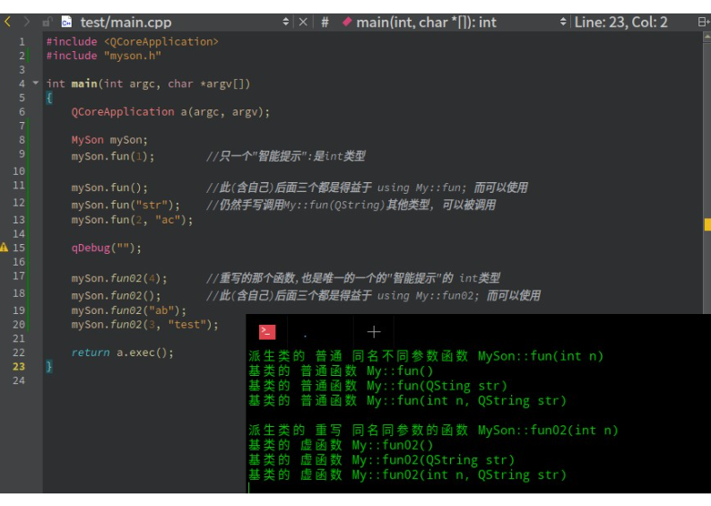

# Using 父类函数名

## 派生类里使用using原因

如果基类中成员函数有多个重载版本，派生类可以重定义所继承的 0 个或多个版本，但是 **通过派生类型只能访问派生类中重定义的那些版本** ，所以如果派生类想通过自身类型使用所有的重载版本，则派生类必须要么重定义所有重载版本，要么一个也不重定义。有时类需要仅仅重定义一个重载集中某些版本的行为，并且想要继承其他版本的含义，在这种情况下，为了重定义需要特化的某个版本而不得不重定义每一个基类版本，可能会令人厌烦。可以在派生类中为重载成员名称提供 using 声明（为基类成员函数名称而作的 using 声明将该函数的所有重载实例加到派生类的作用域），使派生类不用重定义所继承的每一个基类版本。一个 using 声明只能指定一个名字，不能指定形参表，使用using声明将名字加入作用域之后，派生类只需要重定义本类型确实必须定义的那些函数，对其他版本可以使用继承的定义。

## “隐藏”是指派生类的函数屏蔽了与其同名的基类函数

1. 如果派生类的函数与基类的函数同名，但是参数不同。此时，不论有无virtual关键字，基类的函数将被隐藏（注意别与重载混淆）。

2. 如果派生类的函数与基类的函数同名，并且参数也相同，但是基类函数没有virtual关键字。此时，基类的函数被隐藏（注意别与覆盖混淆）

```cpp
class My
{
public:
    My();

    void fun();
    void fun(int n);
    void fun(std::string str);
    void fun(int n, std::string str);

    virtual void fun02();
    virtual void fun02(int n);
    virtual void fun02(std::string str);
    virtual void fun02(int n, std::string str);
};

class MySon : public My
{
public:
    MySon();
    void fun(int n);

    virtual void fun02(int n) override;

    using My::fun;    //本篇所讲
    using My::fun02;  //本篇所讲
};

int main(int argc, char *argv[])
{
    MySon mySon;
    mySon.fun(1);        //只一个"智能提示":是int类型

    mySon.fun();         //此(含自己)后面三个都是得益于 using My::fun; 而可以使用
    mySon.fun("str");    //仍然手写调用My::fun(std::string)其他类型, 可以被调用
    mySon.fun(2, "ac");

    // qDebug("");

    mySon.fun02(4);      //重写的那个函数,也是唯一的一个的"智能提示"的 int类型
    mySon.fun02();       //此(含自己)后面三个都是得益于 using My::fun02; 而可以使用
    mySon.fun02("ab");
    mySon.fun02(3, "test");
}

```


