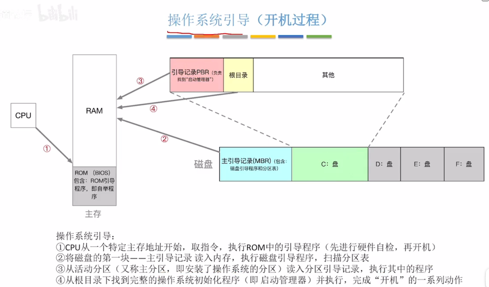

https://www.bilibili.com/video/BV1YE411D7nH/?p=2&vd_source=784cac4665672e741fbe89004f7e0c75

# 第一章 操作系统概述

## 1.1 操作系统的概念、功能、特征

### 1.1.1 概念


控制和管理整个计算机系统的硬件和软件资源，并合理地组织调度计算机的工作和资源的分配以提供给用户和其它软件方便的接口和环境。是计算机系统中最基本的系统软件。

### 1.1.2 功能与目标

1. 系统资源的管理者
    - 功能：CPU管理、存储器管理、文件管理、设备管理
    - 目标：安全、高效

2. 向上层提供方便易用的服务
    - 功能：命令接口（联机（交互式）命令接口，脱机（批处理）命令接口）、GUI、程序接口
    - 目标：方便用户使用

3. 是最接近硬件的一层软件
    - 功能：扩展机器（将各种硬件合理组织起来，能相互协调配合）
    - 目标：使单纯的硬件功能更强，使用更方便

### 1.1.3 操作系统的特征

1. 并发

    多个事件交替发生（宏观同时发生、微观交替进行）。注意和*并行*不一样，并行指多个事件同时发生。

    操作系统和程序并发是一起诞生的。并发性是操作系统最基本的特征。

    **注意：单核CPU同一时刻只能执行一个程序，只能并发执行；多核CPU同一时刻可以执行多个程序，多个程序可以并行执行。e.g., 4核可以并行执行4个程序**

2. 共享

    系统中的资源可供内存中的多个并发执行的进程共同使用。

    失去并发，共享性失去了意义；失去了共享性，并发无法实现。并发和共享互为存在条件。

    - 互斥共享方式：一个时间段内只允许一个进程访问该资源
    - 同时共享方式：允许一个时间段内由多个进程“同时”对它们进行访问


3. 虚拟

    把物理上的实体对应为若干个逻辑上的对应物。e.g., 虚拟RAM（空分复用）， 实际只有4GB，但在用户看来似乎远远大于4GB；虚拟处理器（时分复用）

4. 异步

    在多道程序环境下，允许多个程序并发执行，但由于资源有限，进程的执行不是一贯到底的，而是走走停停的，以不可预知的速度向前推进。只有系统拥有并发性，才有可能导致异步性。

## 1.2 操作系统的发展和分类

## 1.3 操作系统的运行机制

**指令**：指令（机器指令，二进制）是CPU能识别、执行的最基本命令。

我们程序员一般写的“应用程序”。

“内核程序”组成了操作系统内核(Kernel)。一个操作系统可能只有内核就够了，e.g., Docker。有特权指令(e.g., 内存清零)和非特权指令，在CPU设计和生产时就划分了。

程序状态字寄存器(PSW)，有个二进制位，1表示内核态，0表示用户态。

内核态 --> 用户态：执行一条特权指令，操作系统主动让出CPU使用权；
用户态 --> 内核态：由“中断”引发，硬件自动完成变态过程。

## 1.4 中断和异常

**概念**：中断是让操作系统内核夺回CPU使用权的唯一途径。如果没有中断，就没有并发，也没有操作系统。

**中断分类：**
- 内中断（异常）
    - 陷阱（trap）：陷入指令开发，应用程序故意引发
    - 故障（fault）：错误条件引起，可能被内核程序修复。内核程序修复故障后会把使用权还给应用程序。e.g., 缺页故障
    - 终止（abort）：致命错误引起，不能被修复，直接终止。e.g., 整数除0
- 外中断(中断)
    - 时钟中断
    - I/O中断

中断机制的基本原理：不同中断信号需要不同中断处理程序来处理。CPU检测到中断信号之后，根据类型查询中断向量表。中断处理程序显然运行在内核态。

## 1.5 系统调用

**概念**：应用程序通过系统调用请求操作系统的服务。e.g.，凡是与共享资源有关的操作（文件管理、I/O操作、内存分配回收）。保证系统的稳定性和安全性。

**系统调用和库函数的区别：**
    
- 系统调用是操作系统向上层提供的接口
- 有的库函数是对系统调用的进一步封装
- 当今编写的应用程序大多是通过高级语言提供的库函数间接地进行系统调用

## 1.6 操作系统的体系结构

- 非内核功能（GUI）

- 内核
    - 对系统资源进行管理的功能：进程管理、存储器管理、设备管理
    - 时钟管理：实现计时功能
    - 中断处理：负责实现中断机制
    - 原语：是一种特殊的程序，处于操作系统最底层。运行具有原子性，运行时间较短，调用频繁。


## 1.7 操作系统引导

开机时如何让操作系统在电脑上运行起来



## 1.8 虚拟机

第一类虚拟机：直接运行在硬件上

第二类虚拟机：运行在宿主操作系统上

# 第二章 并行与并发

## 2.1 进程和线程

### 2.1.1 进程的概念、组成、特征

- 概念

    **进程**：静态的，存放在磁盘的可执行文件，一系列的指令集和

    **线程**：动态的，程序的一次执行过程

- 组成

    进程被创建时会有个唯一的、不重复的PID。

    记录给进程分配了哪些资源

    记录进程运行的情况

    这些管理所需要的信息数据都被保存在Process Control Block (PCB)中。PCB是给操作系统用的。

    除了PCB之外，还有程序段和数据段，给进程自己用的。

    进程实体（进程映像）由PCB、程序段、数据段组成，是静态的，反映进程在某一时刻的状态。进程是进程实体的运行过程，是系统进行资源分配和调度的一个独立单位。

- 特征

    


### 2.1.2 进程的状态与转换

1. 进程的状态

    - 创建态
    - 就绪态：
    - 运行态：不能直接从阻塞到运行。
    - 阻塞态：不能直接从就绪到阻塞。在进程进行的过程中，有可能会请求某事件发生（如等待某种资源的分配，或者其他进程的响应）。这个事件发生之前进程无法继续往下执行
    - 终止态

2. 进程的组织

    - 链接方式
        
        - 执行指针->PCB2
        - 就绪队列指针->PCB5->PCB1
        - 阻塞队列指针->PCB3->PCB4

    - 索引方式

        - 执行指针
        - 就绪表指针
        - 阻塞表指针

### 2.1.3 进程控制

所谓进程控制就是创建、撤销进程、实现进程状态转换


### 2.1.4 进程通信 IPC

各进程拥有的内存地址空间相互独立。为了保证安全，一个进程不能直接访问另一个进程的地址空间。

1. 共享存储

    通过“增加页表项/段表项”即可将同一片共享内存区映射到各个进程的地址空间中。

    为避免出错，各个进程对共享空间访问互斥，可使用内核提供的同步互斥工具（如P、V操作）

    int shm_open() + void * mmap()

    - 基于存储区：灵活性高 ，速度快，高级

    - 基于数据结构的共享：比如规定只能存一个长度为10的数组。速度慢，限制多，低级S

2. 消息传递

    进程间的数据以格式化的消息为单位，进程通过操作系统提供的“发送/接收消息”两个原语进行数据交换

    - 直接通信：消息发送进程要指明接收进程的id

    - 间接通信：通过信箱间接的通信

3. 管道通信

    管道是个特殊的共享文件，又名pipe文件，其实就是在内存区中开辟一个固定大小的内存缓冲区（循环队列）。一个管道只能实现“半双工通信”
    
    管道写满，写进程阻塞；管道读空，读进程阻塞。

    当多个进程读同一个管道，可能错乱，因为管道中数据一旦被读出就彻底消失。解决方法：1. 一个管道允许多个写进程，一个读进程；2. 允许多个写进程，多个读进程。系统让各个读进程轮流读数据

### 2.1.5 线程

1. 什么是线程，为什么要引入线程？

    进程：多个app“同时”执行

    线程：单个app中不同功能“同时”执行

    线程是一个基本的CPU执行单元，也是程序执行流的最小单位，进一步提高了系统的并发度

2. 引入线程机制后，有什么变化？

    资源分配、调度：进程是资源分配的基本单位，线程是调度的基本单位
    并发性：各线程间也能并发，提升了并发度
    系统开销：可以只在进程中切换，减小了CPU切换环境的系统开销

3. 线程有哪些重要属性？

- 线程是处理机调度的基本单位
- 多CPU计算机中，各个线程可占用不同的CPU
- 每个线程都有一个线程ID、线程控制块（TCB）
- 线程也有就绪、阻塞、运行三种基本状态
- 线程几乎不拥有系统资源
- 同一进程的不同线程间共享进程的资源
- 由于共享内存地址空间，统一进程中的线程间通信甚至无需系统干预
- 同一进程中的线程切换，不会引起进程切换
- 不同进程中的线程切换，会引起进程切换
- 切换同进程内的线程，系统开销很小
- 切换进程，系统开销较大

### 2.1.6 线程的实现方式

1. 用户级线程（ULT）：
由应用管理，从用户的视角看能看到的线程，不涉及CPU变态（用户态->内核态），操作系统意识不到这些线程存在

- 优点：
不需要CPU切换到内核态，线程管理开销小，效率高

- 缺点：
当一个用户级线程被堵塞，整个进程都会被阻塞，并发度不高。多个线程不能在多核处理机上并行

2. 内核级线程（KLT）：
由操作系统管理，从操作系统内核视角看能看到的线程

- 优点：
当一个线程被阻塞后，别的线程还可以继续执行，并发能力强。多线程可以在多核处理机上并行执行

- 缺点：
需要切换核心态，线程管理成本高，开销大

3. 多线程模型

- n个ULT可以映射到m个KLT上（n>=m）

- 内核级线程才是处理机分配的单位

- 用户级线程是“代码逻辑”的载体；内核级线程是“运行机会”的载体

- 一个进程可能对应多个内核级线程

### 2.1.7 线程的状态和转换

## 2.2 处理机调度

### 2.2.1 处理机调度的概念、层次

1. 基本概念

    通常进程数量大于处理机数量，所以要按照一定的算法选择一个进程，并将处理机分配给它运行，以实现进程的并发执行

2. 三个层次

    1. 高级调度（作业调度）

        作业：一个具体任务。用户向系统提交一个作业 = 用户让操作系统启动一个程序。

        辅助外存与内存之间的调度，作业调入时会建立相应的PCB，作业调出时才撤销PCB，调入可由操作系统决定，调出由作业运行结束才调出

    2. 低级调度（进程调度）

        最基本，用算法为进程分配处理机资源，几十ms一次

    3. 中级调度（内存调度）

        将暂时不用的进程放到外存（PCB不外放），提高内存利用率和系统吞吐量，进程状态为挂起状态，形成挂起队列

3. 补充知识


### 2.2.2 进程调度的时机、切换与过程、方式

1、时机

什么时候需要进程调度？
- 主动放弃（进程正常终止、运行过程中发生异常而终止、进程主动请求阻塞）
- 被动放弃（分给进程的时间片用完、有更紧急的事需要处理、有更高优先级的进程进入就绪队列）


什么时候不能进行进程调度？
- 在处理中断的过程中
- 在操作系统内核程序临界区中
- 临界资源：一个时段段内各进程互斥地访问临界资源
- 临界区：访问临界资源的那段代码
- 内核程序临界区会访问就绪队列，导致其上锁
- 在原子操作过程中（原语）
  
2、切换与过程

“狭义的调度”与“进程切换”的区别
- 狭义：选择一个进程
- 广义：狭义+进程切换
进程切换的过程需要做什么？
- 对原来运行进程各种数据的保存
- 对新的进程各种数据的恢复
- 
3、方式

非剥夺调度方式（非抢占式）
- 只允许进程主动放弃处理机


剥夺调度方式（抢占式）
- 进程被动放弃，可以优先处理紧急任务，适合分时操作系统、实时操作系统


### 2.2.3 调度器和闲逛进程

### 2.2.4 调度算法的评价指标

1. CPU利用率
CPU利用率=CPU忙碌的时间/总时间


2. 系统吞吐量
系统吞吐量=总共完成了多少道作业/总共花了多少时间

3. 周转时间

- 周转时间（提交作业到完成作业花费的时间）、平均周转时间（各作业周转时间之和/作业数）

- 带权周转时间（作业周转时间/作业实际运行的时间）、平均带权周转时间（各作业带权周转时间/作业数）

4. 等待时间

进程或作业等待处理机状态时间的和

进程：等待被服务的时间之和

作业：建立后的等待时间+作业在外存后备队列中等待的时间

5. 响应时间

从用户提交请求到首次产生响应所用的时间

### 2.2.5 FCFS、SJF、HRRN调度算法

#### 2.2.5.1 先来先服务（FCFS）

先到达先进行服务

作业-后备队列；进程-就绪队列

非抢占式

公平、算法简单

对长作业有利、对短作业不利

不会饥饿

#### 2.2.5.2 短作业优先（SJF，shortest job first）

最短（服务时间最短）的作业优先得到服务，时间相同，先到达的先被服务

非抢占式（SJF）：选最短需要时间的作业先进入运行态

抢占式（SRTN）：有新作业进入就绪队列或有作业完成了，考察队列中的最小需要时间的作业

在所有进程都几乎同时到达时，采用SJF调度算法的平均等待时间、平均周转时间最少

若无红色前提，抢占式的短作业/进程的平均时间最少

优点：“最短的”平均等待时间，平均周转时间

缺点：对短作业有利，对长作业不利

可能产生饥饿现象

#### 2.2.5.3 高响应比优先（HRRN）

综合考虑作业/进程的等待时间和要求服务的时间

在每次调度时先计算各个作业/进程的响应比，选择响应比最高的作业/进程为其服务

响应比=（等待时间+要求服务时间）/要求服务时间

非抢占式

进程主动放弃CPU时，需要该算法选取就绪队列的作业

不会饥饿


### 2.2.6 时间片轮转、优先级调度、多级反馈队列（适合交互式系统）

#### 2.2.6.1 时间片轮转算法（RR）

算法思想：公平轮流地位各个进程服务，让每个进程在一定时间间隔内都可以得到响应

算法规则：按照各进程到达就绪队列的顺序，轮流让各个进程执行一个时间片（如100ms）。若进程未在一个时间片内执行完，则剥夺处理机，将进程重新放到就绪队列对位重新排队。

只能用于进程调度

抢占式

优点：响应块，适用于分时操作系统

缺点：由于高频率的进程切换，因此有一定的开销；不区分任务的紧急程度

不会饥饿


#### 2.2.6.2 优先级调度算法

算法思想：根据任务的紧急程度来决定处理顺序

算法规则：每个进程/作业有各自的优先级，调度时选择优先级最高的作业/进程

适用：作业/进程/IO

抢占式/不可抢占均有

静态优先级：不变

动态优先级：可以变

通常：系统进程优先级高于用户进程，前台进程优先级高于后台进程，操作系统更偏好I/O进程

可以从追求公平、提升资源利用率等角度考虑改变优先级

可能会饥饿

#### 2.2.6.3 多级反馈队列调度算法

算法思想：对其它算法调度的这种权衡

算法实现：设置多级就绪队列，各级队列优先级从高到低，时间片从小到大。新进程到达时先进入第一级队列，按照FCFS原则排队等待被分配时间片。若用完时间片进程还未结束，则进程进入下一级队列对位。如果此时已经在最下级的队列，则重新放回最下级队列末尾。啊只有第K级队头的进程为空时，才会为K+1级对头的进程分配时间片，被抢占处理机的进程重新放回原队列队尾。

优点：对各个进程相对公平（FCFS的优点），每个新到达的进程都可以很快就得到响应（RR的优点）；短进程只用较少的时间就可以完成（SPF的优点）；不必实现估计进程的运行时间（避免用户作假）；可灵活地调整对各类进程的偏好程度，比如CPU密集型进程、IO密集型进程

默认抢占式

会饥饿

## 2.3 进程

### 2.3.1 进程同步、进程互斥

1. 进程同步
   
指为了完成某种任务而建立的两个或多个进程，这些进程因为需要在某些位置上协调他们的工作次序而产生的制约关系。进程间的直接制约关系就是源于它们之间的相互合作。

2. 进程互斥
   
把一个时间段内只允许一个进程使用的资源称为临界资源。


对临界资源的互斥访问，可以在逻辑上分为四个部分：
```c
do{
  entry section;  //进入区  对访问的资源检查或进行上锁
  critical section; //临界区(段) 访问临界资源的那部分代码
  exit section;   //退出区  负责解锁
  remainder section; //剩余区  其它处理
} while(true)
```

1、空闲让进。 空的可以直接进去

2、忙则等待。 繁忙不能进去

3、有限等待。 不能让进程等待无限长时间

4、让权等待。 不能进去，不要堵着

### 2.3.2 进程互斥的软件实现方法

1. 单标志法

两个进程在访问完临界区后会把使用临界区的权限教给另一个进程。也就是说每个进程进入临界区的权限只能被另一个进程赋予

```c
int turn =0;
//p0进程
while(turn!=0);
critical section;
turn = 1;
remainder section;
//p1进程
while(turn!=1);
critical section;
turn = 0;
remainder section;
```

可以实现互斥

存在的问题：p1要访问的话，必须p0先访问，违背：空闲让进原则


2. 双标志先检查 

算法思想:设置一个bool数组flag[]来标记自己是否想要进入临界区的意愿

```c
bool flag[2]={false,false};
//p1进程
while(flag[1]);
flag[0]=true;
critical section;
flag[0]=false;
remainder section;
//p2进程
while(flag[0]);
flag[0]=true;
critical section;
flag[1]=false;
remainder section;
```

主要问题：由于进程是并发进行的，可能会违背忙则等待的原则

3. 双标志后检查

算法思想:设置一个bool数组flag[]来标记自己是否想要进入临界区的意愿,不过是先上锁后检查

```c
bool flag[2]={false,false};
//p1进程
flag[0]=true;
while(flag[1]);
critical section;
flag[0]=false;
remainder section;
//p2进程
flag[0]=true;
while(flag[0]);
critical section;
flag[1]=false;
remainder section;
```

主要问题：由于进程是并发进行的，可能会两个同时上锁，都进不去，违反空闲让进和有限等待原则

4. Peterson 算法
   
两个进程在访问完临界区后会把使用临界区的权限教给另一个进程。也就是说每个进程进入临界区的权限只能被另一个进程赋予

```c
bool flag[2]={false,false};
int turn=0;
//p1进程
flag[0]=true;
turn=1;
while(flag[1]&&turn==1);
critical section;
flag[0]=false;
remainder section;
//p2进程
flag[1]=true;
turn=0;
while(flag[0]&&turn==0);
critical section;
flag[1]=false;
remainder section;

```

主要问题：遵循空闲让进、忙则等待、有限等待三个原则
但是未遵循让权等待的原则（进不了临界区一直卡在while循环）

### 2.3.3 进程互斥的硬件实现方法

1. 中断屏蔽

关中断（不允许进程中断）
临界区
开中断

简单、高效

多处理机，可能会同时访问临界资源
使用OS内核进程

2. TestAndSet（TSL指令）
   
TSL是用硬件实现的，上锁、检查一气呵成

不满足让权等待，会盲等

C语言描述逻辑：
```c

//true表示已经上锁
bool TestAndSet(bool *lock){
  bool old;
  old=*lock;
  *lock=true;
  return old;
}

//以下是使用TSL指令实现互斥的算法逻辑
while(TestAndSet (&lock));//上锁并检查
临界区代码段
lock=false; //解锁
```

3. Swap指令

别称：Exchange指令、XCHG指令
Swap指令是用硬件实现的

```c
//true表示已经上锁
void Swap(bool *a,bool *b){
  bool temp;
  temp=*a;
  *a=*b;
  *b=temp;
}

//以下是使用Swap指令实现互斥的算法逻辑
bool old=true;
while(old=true)
  Swap(&lock,&old);
临界区代码段
lock=false; //解锁
//剩余代码段
```

简单

适用多处理机

不能让权等待

### 2.3.4 互斥锁

```c
acquire()
    while(!available)
        ; // 忙等待
    available = false;

release()
    available = true;
```

互斥锁主要缺点是忙等待，当有一个进程在临界区，任何其他进程在进入临界区时必须连续调用acquire()

当多个进程共享同一cpu时，就浪费了cpu周期，一般适用于多核

需要连续循环忙等的互斥锁都可以称为自旋锁(spin lock)，如TSL指令，Swap指令，单标志法

### 2.3.5 信号量机制

信号量：信号量是一种变量，表示系统中某种资源的数量

一对原语：wait（S）原语和signal（S）原语，分别简称P（S）、V（S）。可以理解为我们自己写的函数，S信号量是传入的参数

1. 整形信号量

用一个整数表示系统资源的变量，用来表示系统中某种资源的数量

```c
int S=1; // 标识系统中可用的资源数
void wait(int S){ //wait原语，相当于：进入区
  while(S<=0); //如果资源数不够，就意志循环等待
  S=S-1;    //如果资源数够，则占用一个资源
}

void signal(int S){//signal原语，相当于“退出区”
  S=S+1;    //使用完资源后，在退出区释放资源
}

进程Pn:
...
wait(S);    // 进入区，申请资源
使用资源... // 临界区，访问资源
signal(S); // 退出去，释放资源
```

可能会出现盲等

2. 记录型信号量

```c
//记录型信号量的定义
typedef struct{
  int value;           // 剩余资源数
  struct process *L;   // 等待队列
} semaphore;
//某进程需要使用资源时，通过wait原语申请
void wait (semaphore S){
  S.value--;
  if(S.value<0){
    block (S.L);//将该进程加入到消息队列中
 }
}
//进程使用完资源后，通过signal原语释放
void signal (semaphore S){
  S.value++;
  if(S.valie<=0){
    wakeup(S.L);
 }
}
```


除非特别说明，否则默认S为记录型信号量


### 2.3.6 用信号量机制实现进程互斥、同步、前驱关系

**P操作（Proberen，意为尝试）：这是获取信号量的操作，类似于Wait操作。 执行P操作时，如果信号量的值大于零，就将其减1，否则进程会被阻塞。**

**V操作（Verhogen，意为增加）：这是释放信号量的操作，类似于Signal操作。 执行V操作时，会将信号量的值加1，表示释放了一个资源。**

1. 实现进程互斥

```c

// 1. 划定临界区
// 2. 设置互斥信号量mutex，初值为1
// 3. PV操作
semaphore mutex = 1; // 初始化信号量

P1(){
    ...
    P(mutex); // 加锁
    临界区代码
    V(mutex); // 解锁
}
```

对不同的临界资源需要设置不同的互斥信号量

PV必须成对出现

2．实现进程同步

```c
// 1. 分析保证一前一后的操作顺序
// 2. 设置同步信号量S，初始为0
// 3. 在“前操作”之后执行V(S)
// 4. 在“后操作”之后执行P(S)

/* 保证代码4在2之后执行 */
semaphore S = 0;

P1(){
    代码1;
    代码2;
    V(S);
    代码3;
}

P2(){
    P(S);  // 若先执行，S==-1，执行block原语主动请求阻塞
    代码4;
    代码5;
    代码6;
}

```

前V后P

3. 实现进程的前驱关系

要为每一对前驱关系各设置一个同步变量

在“前操作”之后对相应的同步变量执行V操作

在“后操作”之前对相应的同步变量执行P操作


### 2.3.7 生产者-消费者问题

只有缓冲区没满时，生产者才能把产品放入缓冲区，否则必须等待

只有缓冲区不空时，消费者才能从中取出产品，否则必须等待

缓冲区是临界资源，各个进程互斥访问

```c
semaphore mutex = 1； //互斥信号量，实现对缓冲区的互斥访问

semaphore empty = n; // 同步信号量，表示空闲缓冲区的数量

semaphore full = 0; // 同步信号量，表示产品的数量，即飞空缓冲区的数量

producer(){
    while(1){
        生产一个产品;
        P(empty);  // 消耗一个空闲缓冲区
        P(mutex);
        把产品放入缓冲区;
        V(mutex);   // 实现互斥是在同一进程中的PV操作
        V(full);   // 增加一个产品，前V后P
    }
}

consumer(){
    while(1){
        生产一个产品;
        P(full);  
        P(mutex);
        从缓冲区取出;
        V(mutex);  
        V(empty);
        使用产品;
    }
}
```

实现互斥的P操作要放在实现同步的P操作之后，不然会发生死锁

V操作不会导致进程发生阻塞的状态，所以可以交换顺序

使用操作不要放在临界区，不然并发度会降低


### 2.3.8 多生产者-多消费者模型

在生产-消费者问题中，如果缓冲区大小为1，那么有可能不需要设置互斥信号量就可以实现互斥访问缓冲区

分析同步问题是，应该从“事件”的角度来考虑

### 2.3.9 吸烟者问题


解决“可以让生产多个产品的单生产者”问题提供一个思路；

若一个生产者要生产多种产品（或者说会引发多种前驱事件），那么各个V操作应该放在各自对应的“事件”发生之后的位置

### 2.3.10 读者-写者问题

1、允许多个读者同时对文件执行读操作

2、只允许一个写者往文件中写信息

3、任一写者在完成写操作之前不允许其他读者或写者工作

4、写者执行写操作前，应让已有的读者和写者全部退出

```c
semaphore rw=1;//用于实现对文件的互斥访问。表示当前是否有进程在访问共享文件
int count=0;//记录当前有几个读进程在访问文件
semaphore mutex=1;//用于保证对count变量的互斥访问
semaphore w=1; //用于实现“写优先”
  
writer(){
  while(1){
    P(w);
    P(rw); //写之前“加锁”
    写文件...
    V(rw);//写之后“解锁”
    V(w);
 }
}

reader(){
    while(1){
        P(w);
        P(mutex); //各读进程互斥访问count
        if(count==0) 
            P(rw); //第一个读进程的读进程数+1
        count++; //访问文件的读进程数+1
        V(mutex); 
        V(w);
        读文件...
        P(mutex); //各读进程互斥访问count
        count--; //访问文件的读进程数-1
        if(count==0)
            V(rw); //最后一个读进程负责“解锁”
        V(mutex);
    }
}

```

核心思想在于用了counter记录当前正在访问共享文件的读进程数

### 2.3.11 哲学家进餐问题

五个人，必须拿左右的筷子才能吃饭

避免死锁发生

解决方案：

1、可以对哲学家进程施加一些限制条件，比如最多允许四个哲学家同时进餐，这样可以保证至少有一个哲学家是可以拿到左右两只筷子的。

2、要求奇数号哲学家先拿左边的筷子，然后再拿右边的筷子，而偶数号哲学家刚好相反。用这种方法可以保证如果相邻的两个奇偶号哲学家都想吃饭，那么只会有其中一个可以拿起第一只筷子，另一个会直接阻塞。这就避免了占有一只后再等待另一只的情况。

3、仅当一个哲学家左右两只筷子都可用时才允许他抓起筷子。

```c
semaphore chopstick[5]={1,1,1,1,1};
semaphore mutex = 1; //互斥地取筷子
Pi(){     //i号哲学家的进程
  while(1){
    P(mutex);
    p(chopstick[i]);   //拿右
    p(chopstick[(i+1)%5]);//拿左
    V(mutex);
    吃饭...
    V(chopstick[i]);
    V(chopstick[(i+1)%5]);
    思考...
 }
}

```

### 2.3.12 管程

#### 2.3.12.1 为什么引入

PV操作容易出错、困难

#### 2.3.12.2 定义

一种特殊的软件模块：
- 局部于管程的共享数据结构说明
- 对该数据结构进程操作的一组过程（函数）
- 对局部于管程的共享数据设置初始值的语句
- 管程有一个名字


#### 2.3.12.3 基本特征

- 局部于管程数据结构只能被局部于管程的过程所访问
- 一个进程只有通过调用管程内的过程才能进入管程访问共享数据
- 每次仅允许一个进程在管程内执行某个内部过程

心得：相当于C++的类，管程是数据放在private中，函数放在public中

#### 2.3.12.4 拓展1：用管程解决生产者消费者问题

```c
monitor producerconsumer
  condition full,empty;
  int count = 0;
  void insert(Item item){
    if(count == N)
      wait(full);
    count++;
    insert_item (item);
    if(count == 1)
      signal(empty);
 }
  Item remove(){
    if(count == 0)
      wait(empty);
    count--;
    if(count == N-1)
      signal(full);
    return remove_item();
 }
  end monitor;

//使用
producer(){
  while(1){
    item = 生产一个产品;
    producerconsumer.insert(item);
 }
}

consumer(){
  while(1){
    item = producerconsumer.remove();
    消费产品 item;
 }
}

```


## 2.4 死锁

### 2.4.1 概念

1. 死锁
    各进程互相等待对方手里的资源，导致各进程都阻塞，无法向前推进的现象。

2. 进程死锁、饥饿、死循环的区别

- 死锁：

    定义：各进程互相等待对方手里的资源，导致各进程都阻塞，无法向前推进的现象。

    区别：至少两个或两个的进程同时发生死锁

- 饥饿：

    定义：由于长期得不到想要的资源，某进程无法向前推进的现象。

    区别：可能只有一个进程发生饥饿

- 死循环：
  
    定义：某进程执行过程中一直跳不出某个循环的现象。

    区别：死循环是程序员的问题

3. 死锁产生的必要条件

- 互斥条件：多个进程争夺资源发生死锁
- 不剥夺条件：进程获得的资源不能由其它进程强行抢夺
- 请求和保持条件：某个进程有了资源，还在请求资源
- 循环等待条件：存在资源的循环等待链

4. 什么时候会发生死锁

- 对系统资源的竞争
- 进程推进顺序非法
- 信号量的使用不当也会造成死锁

5. 死锁的处理策略

- 预防死锁
- 避免死锁
- 死锁的检测和解除

### 2.4.2 预防死锁

静态策略：
- 破坏互斥条件（有些不能破坏）

  把互斥的资源改造为共享资源

- 破坏不剥夺条件（复杂，造成之前工作失效，降低系统开销，会全部放弃、导致饥饿）

    方案1：当请求得不到满足的时候，立即释放手里的资源

    方案2：由系统介入，强行帮助剥夺

- 破坏请求和保持条件（资源利用率极低，可能会导致某些进程饥饿）

    采用静态分配方法，一次性全部申请，如果申请不到，不要允许


- 破坏循环等待条件（不方便增加新的设备，实际使用与递增顺序不一致，会导致资源的浪费，必须按规定次序申请资源）

    顺序资源分配法：对资源编号，进程按编号递增顺序请求资源


### 2.4.3 避免死锁


动态策略：

- 什么是安全序列
    进行后面的某些情况，不会使系统发生死锁
- 什么是系统的不安全状态，与死锁有何联系
    如果系统处于安全状态，就一定不会发生死锁。如果系统进入不安全状态，就可能发生死锁（处于不安全状态未必就是发生了死锁，但发生死锁时一定时在不安全状态）
- 如何避免系统进入不安全状态——银行家算法
    初始分配完成后，优先全部分配给最少的，并且拿回资源


### 2.4.4 检测和解除

死锁的检测

1、用某种数据结构来保存资源的请求和分配信息

2、提供一种算法，利用上述信息来检测系统是否已进入死锁状态

死锁的解除

1、资源剥夺法：挂起某些死锁进程，并抢占它的资源，将这些资源分配给其他的死锁进程。

2、撤销进程法：强制撤销部分，甚至全部死锁进程，并剥夺这些进程的资源。

3、进程回退法：让一个或多个死锁进程回退到足以避免死锁的地步。
