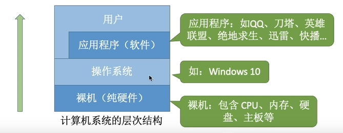

https://www.bilibili.com/video/BV1YE411D7nH/?p=2&vd_source=784cac4665672e741fbe89004f7e0c75

# 第一章 操作系统概述

## 1.1 操作系统的概念、功能、特征

### 1.1.1 概念

控制和管理整个计算机系统的硬件和软件资源，并合理地组织调度计算机的工作和资源的分配以提供给用户和其它软件方便的接口和环境。是计算机系统中最基本的系统软件。

### 1.1.2 功能与目标

1. 系统资源的管理者
    - 功能：CPU管理、存储器管理、文件管理、设备管理
    - 目标：安全、高效

2. 向上层提供方便易用的服务
    - 功能：命令接口（联机（交互式）命令接口，脱机（批处理）命令接口）、GUI、程序接口
    - 目标：方便用户使用

3. 是最接近硬件的一层软件
    - 功能：扩展机器（将各种硬件合理组织起来，能相互协调配合）
    - 目标：使单纯的硬件功能更强，使用更方便

### 1.1.3 操作系统的特征

1. 并发

    多个事件交替发生（宏观同时发生、微观交替进行）。注意和*并行*不一样，并行指多个事件同时发生。

    操作系统和程序并发是一起诞生的。并发性是操作系统最基本的特征。

    **注意：单核CPU同一时刻只能执行一个程序，只能并发执行；多核CPU同一时刻可以执行多个程序，多个程序可以并行执行。e.g., 4核可以并行执行4个程序**

2. 共享

    系统中的资源可供内存中的多个并发执行的进程共同使用。

    失去并发，共享性失去了意义；失去了共享性，并发无法实现。并发和共享互为存在条件。

    - 互斥共享方式：一个时间段内只允许一个进程访问该资源
    - 同时共享方式：允许一个时间段内由多个进程“同时”对它们进行访问

3. 虚拟

    把物理上的实体对应为若干个逻辑上的对应物。e.g., 虚拟RAM（空分复用）， 实际只有4GB，但在用户看来似乎远远大于4GB；虚拟处理器（时分复用）

4. 异步

    在多道程序环境下，允许多个程序并发执行，但由于资源有限，进程的执行不是一贯到底的，而是走走停停的，以不可预知的速度向前推进。只有系统拥有并发性，才有可能导致异步性。

## 1.2 操作系统的发展和分类

## 1.3 操作系统的运行机制

指令（机器指令，二进制）是CPU能识别、执行的最基本命令。

“内核程序”组成了操作系统内核(Kernel)。一个操作系统可能只有内核就够了，e.g., Docker。有特权指令(e.g., 内存清零)和非特权指令，在CPU设计和生产时就划分了。

程序状态字寄存器(PSW)，有个二进制位，1表示内核态，0表示用户态。

内核态 --> 用户态：执行一条特权指令，操作系统主动让出CPU使用权；
用户态 --> 内核态：由“中断”引发，硬件自动完成变态过程。