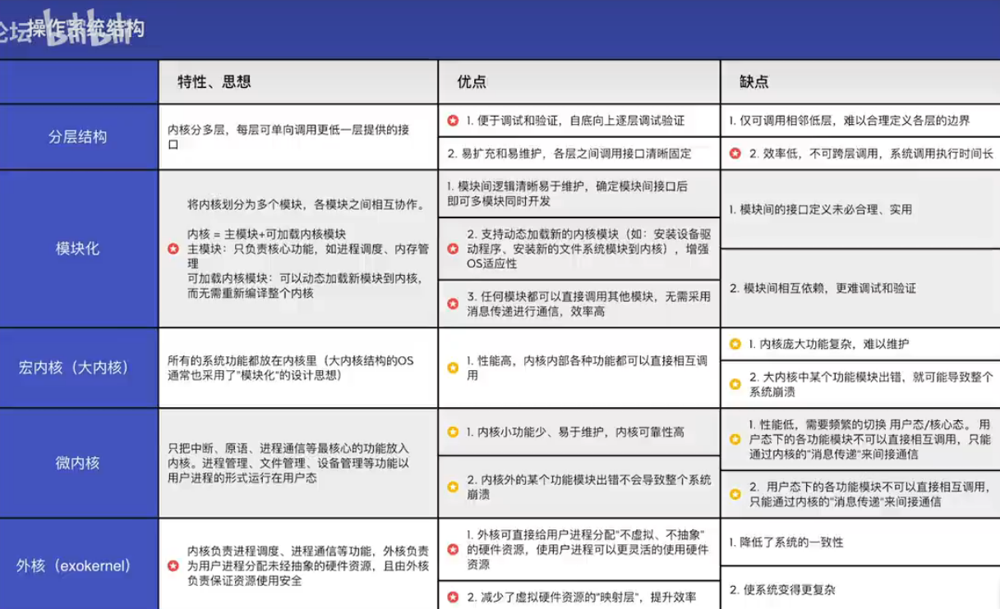
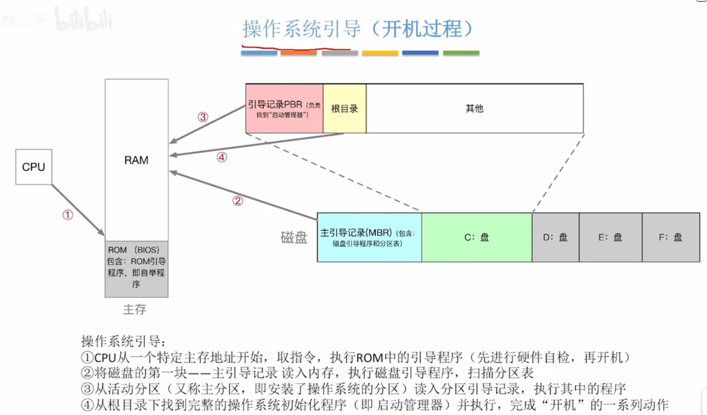
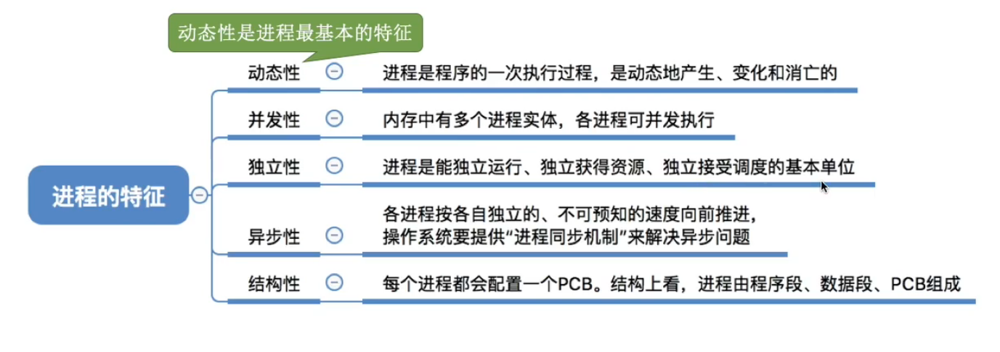

https://www.bilibili.com/video/BV1YE411D7nH/?p=2&vd_source=784cac4665672e741fbe89004f7e0c75

# 第一章 操作系统概述

## 1.1 操作系统的概念、功能、特征

### 1.1.1 概念

控制和管理整个计算机系统的硬件和软件资源，并合理地组织调度计算机的工作和资源的分配以提供给用户和其它软件方便的接口和环境。是计算机系统中最基本的系统软件。

### 1.1.2 功能与目标

1. 系统资源的管理者
    - 功能：CPU管理、存储器管理、文件管理、设备管理
    - 目标：安全、高效

2. 向上层提供方便易用的服务
    - 功能：命令接口（联机（交互式）命令接口，脱机（批处理）命令接口）、GUI、程序接口
    - 目标：方便用户使用

3. 是最接近硬件的一层软件
    - 功能：扩展机器（将各种硬件合理组织起来，能相互协调配合）
    - 目标：使单纯的硬件功能更强，使用更方便

### 1.1.3 操作系统的特征

1. 并发

    多个事件交替发生（宏观同时发生、微观交替进行）。注意和*并行*不一样，并行指多个事件同时发生。

    操作系统和程序并发是一起诞生的。并发性是操作系统最基本的特征。

    **注意：单核CPU同一时刻只能执行一个程序，只能并发执行；多核CPU同一时刻可以执行多个程序，多个程序可以并行执行。e.g., 4核可以并行执行4个程序**

2. 共享

    系统中的资源可供内存中的多个并发执行的进程共同使用。

    失去并发，共享性失去了意义；失去了共享性，并发无法实现。并发和共享互为存在条件。

    - 互斥共享方式：一个时间段内只允许一个进程访问该资源
    - 同时共享方式：允许一个时间段内由多个进程“同时”对它们进行访问

3. 虚拟

    把物理上的实体对应为若干个逻辑上的对应物。e.g., 虚拟RAM（空分复用）， 实际只有4GB，但在用户看来似乎远远大于4GB；虚拟处理器（时分复用）

4. 异步

    在多道程序环境下，允许多个程序并发执行，但由于资源有限，进程的执行不是一贯到底的，而是走走停停的，以不可预知的速度向前推进。只有系统拥有并发性，才有可能导致异步性。

## 1.2 操作系统的发展和分类

## 1.3 操作系统的运行机制

**指令**：指令（机器指令，二进制）是CPU能识别、执行的最基本命令。

我们程序员一般写的“应用程序”。

“内核程序”组成了操作系统内核(Kernel)。一个操作系统可能只有内核就够了，e.g., Docker。有特权指令(e.g., 内存清零)和非特权指令，在CPU设计和生产时就划分了。

程序状态字寄存器(PSW)，有个二进制位，1表示内核态，0表示用户态。

内核态 --> 用户态：执行一条特权指令，操作系统主动让出CPU使用权；
用户态 --> 内核态：由“中断”引发，硬件自动完成变态过程。

## 1.4 中断和异常

**概念**：中断是让操作系统内核夺回CPU使用权的唯一途径。如果没有中断，就没有并发，也没有操作系统。

**中断分类：**
- 内中断（异常）
    - 陷阱（trap）：陷入指令开发，应用程序故意引发
    - 故障（fault）：错误条件引起，可能被内核程序修复。内核程序修复故障后会把使用权还给应用程序。e.g., 缺页故障
    - 终止（abort）：致命错误引起，不能被修复，直接终止。e.g., 整数除0
- 外中断(中断)
    - 时钟中断
    - I/O中断

中断机制的基本原理：不同中断信号需要不同中断处理程序来处理。CPU检测到中断信号之后，根据类型查询中断向量表。中断处理程序显然运行在内核态。

## 1.5 系统调用

**概念**：应用程序通过系统调用请求操作系统的服务。e.g.，凡是与共享资源有关的操作（文件管理、I/O操作、内存分配回收）。保证系统的稳定性和安全性。

**系统调用和库函数的区别：**
    
- 系统调用是操作系统向上层提供的接口
- 有的库函数是对系统调用的进一步封装
- 当今编写的应用程序大多是通过高级语言提供的库函数间接地进行系统调用

## 1.6 操作系统的体系结构

- 非内核功能（GUI）

- 内核
    - 对系统资源进行管理的功能：进程管理、存储器管理、设备管理
    - 时钟管理：实现计时功能
    - 中断处理：负责实现中断机制
    - 原语：是一种特殊的程序，处于操作系统最底层。运行具有原子性，运行时间较短，调用频繁。

## 1.7 操作系统引导

开机时如何让操作系统在电脑上运行起来

## 1.8 虚拟机

第一类虚拟机：直接运行在硬件上

第二类虚拟机：运行在宿主操作系统上

# 第二章 并行与并发

## 2.1 进程和线程

### 2.1.1 进程的概念、组成、特征

- 概念

    **进程**：静态的，存放在磁盘的可执行文件，一系列的指令集和

    **线程**：动态的，程序的一次执行过程

- 组成

    进程被创建时会有个唯一的、不重复的PID。

    记录给进程分配了哪些资源

    记录进程运行的情况

    这些管理所需要的信息数据都被保存在Process Control Block (PCB)中。PCB是给操作系统用的。

    除了PCB之外，还有程序段和数据段，给进程自己用的。

    进程实体（进程映像）由PCB、程序段、数据段组成，是静态的，反映进程在某一时刻的状态。进程是进程实体的运行过程，是系统进行资源分配和调度的一个独立单位。

- 特征

    

### 2.1.2 进程的状态与转换

1. 进程的状态

    - 创建态
    - 就绪态：
    - 运行态：不能直接从阻塞到运行。
    - 阻塞态：不能直接从就绪到阻塞。在进程进行的过程中，有可能会请求某事件发生（如等待某种资源的分配，或者其他进程的响应）。这个事件发生之前进程无法继续往下执行
    - 终止态

2. 进程的组织

    - 链接方式
        
        - 执行指针->PCB2
        - 就绪队列指针->PCB5->PCB1
        - 阻塞队列指针->PCB3->PCB4

    - 索引方式

        - 执行指针
        - 就绪表指针
        - 阻塞表指针

### 2.1.3 进程控制

所谓进程控制就是创建、撤销进程、实现进程状态转换
