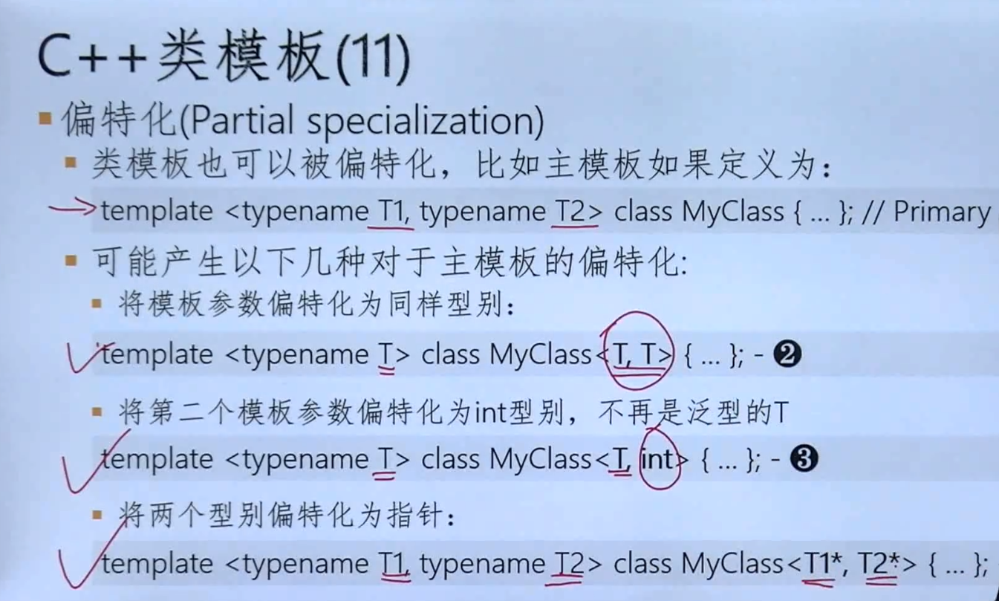
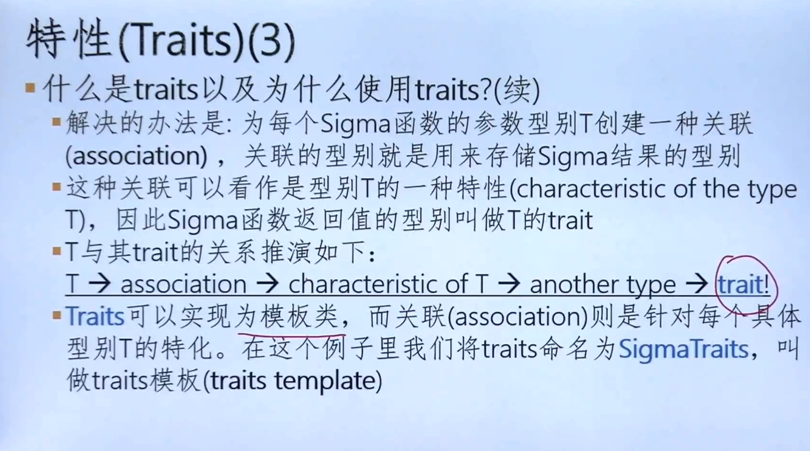
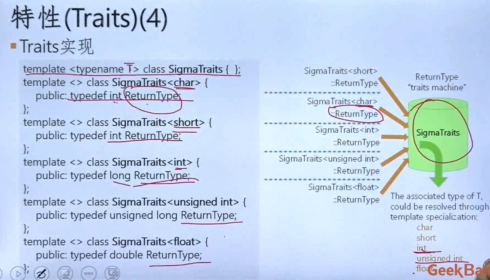
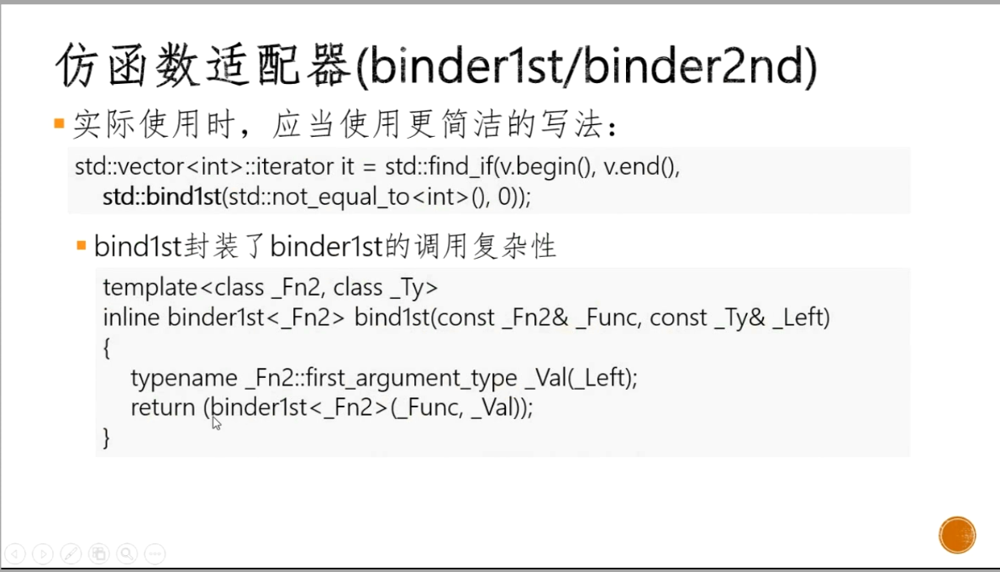
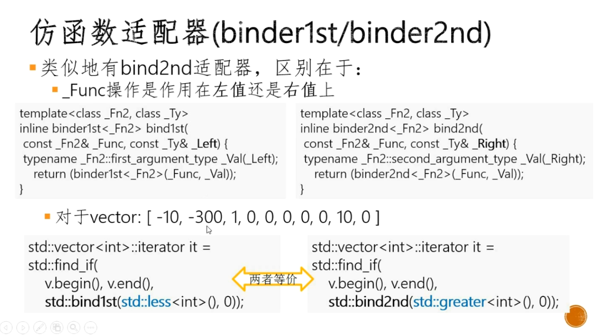

# 1 模板观念与函数模板

用具体类别替换模板参数T的过程叫实例化。
一旦使用函数模板，这种过程由编译器自动触发，不需要额外请求。
模板被编译两次，实例化之前，检查模板代码本身是否有语法错误。实例化期间，检查对模板代码的调用是否合法。

实例化有两种类型————隐式和显式
```
Max<>(static_cast<double>(1), 2.0);
Max<double>(1, 2.0);
```

# 2 类末班与操作符重载

```cpp
const std::size_t DefaultStackSize = 1024;
template<typename T, typename TContainer = std::vector<T>, std::size_t n = DefaultStackSize> class Stack{
public:
    void push(const T const& element);
    int Pop(T& element);
    int Top(T& element) const;
private:
    TContainer m_Members;
    std::size_t m_nMaxSize = n; // n是编译时定义的常量，n可以有默认值
}
```

- 模版类特化
    - 允许对一个类模板的某些参数类别做特化
    - 好处/作用：
      - 对某种特殊类别可以做优化或不同实现
      - 避免实例化时一些诡异行为
    - 做法
      - ```cpp
        template<>
        class Stack<std::wstring>{ ... };
        ```

- 偏特化
  - 
  

# 3 泛型编程





迭代器是指针的泛化，与算法的接口

# 4 容器

# 5 STL

# 6 仿函数





# 7 容器扩展

# 8 泛型————非变易算法(Non-Mutating)

# 9 泛型————变易算法(Mutating)

# 10 排序

# 11 数值算法

# 12 内存分配